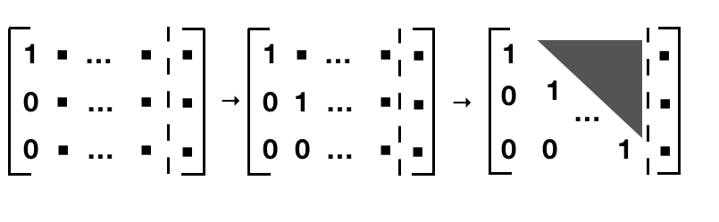
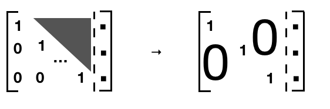
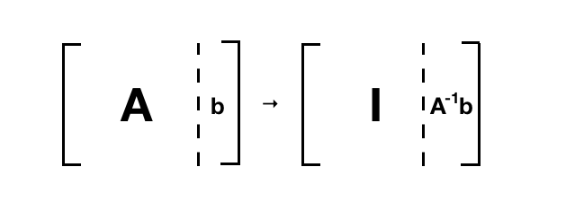

# 高斯消元法 {Gaussian elimination}


这篇文章只是尝试把高斯消元法写的更清楚一点。


考虑方程：

$$
A \mathbf{x} = \mathbf{b}
$$

$A \in R^{m \times n}, x \in R^n, b \in R^m$, 考虑A可逆，也就是以上方程只有唯一解。


## 数学


这实际上就是我们解矩阵方程组一般使用的方式，比如方程组是：

$$
a_{11}x_1 + a_{12}x_2 + \cdots + a_{1n}x_n = b_1 \\
a_{21}x_1 + a_{22}x_2 + \cdots + a_{2n}x_n = b_2 \\
\cdots \\
a_{m1}x_1 + a_{m2}x_2 + \cdots + a_{mn}x_n = b_m \\
$$

我们一般把它写成增广矩阵：

$$
\begin{bmatrix}
a_{11} & a_{12} &  \cdots &  a_{1n} & b_1 \\
a_{21} & a_{22} &  \cdots &  a_{2n} & b_2 \\
       &      \cdots    &      \\   
a_{m1} & a_{m2} &  \cdots &  a_{mn} & b_m \\
\end{bmatrix}
$$

首先化简成阶梯型矩阵的形式：

- $row_1 / a_{11}$
- $row_2 - k * row_1, k = \frac{a_{21}}{a_{11}}$ 
- ...

这样第一列就化为 $\begin{bmatrix} 1 \\ \vdots \\ 0 \end{bmatrix}$

对于第二列我们可以继续类似的操作：

- $row_2 / (current)a_{22}$
- $\cdots$





经过这些操作矩阵A变成这样的一个上三角矩阵。 我们可以很容易的得到 $x_m$ , 再往上回代就可以得到 $x_1 \cdots x_m$：




- $x_m$ get
- $row_{m-1} - k * row$
- $\cdots$


所以整个过程就只包括两个操作：

- $row * k$
- $row_j + row_i * k$

我们也可以用另一种观点来看上述过程，其实也是三步：

- LU decomposition: A = LU ;
- Forward substitution: solve Ly = b ;
- Backward substitution: solve U x = y .

不过我们的前两步比较隐式和同时进行。

实际在计算机中计算，可能会出现的问题：


- $a_{11}$ 为0，不能除0
- $a_{11}  \ll 1$，除以一个很小很小的数会带来很多问题，比如overflow等


解决的办法就是行交换，把比较大的pivot放在前面。其实这个我们手动解 $A\mathbf{x} = \mathbf{b}$ 的时候就会这样做，英文叫做 Gaussian elimination with partial pivoting (GEPP).

这里有一个具体的例子 https://web.mit.edu/10.001/Web/Course_Notes/GaussElimPivoting.html

这个英文就暗示了还有别的方法，因为这是 partial pivoting，还有一种 total pivoting，就是不仅仅只考虑行的交换，比如我们为了得到最大的$a_{11}$, 我们也把列的交换也考虑上。


因为有行交换的原因，所以严格写会是：

$$
A = PLU
$$


同样也可以用另一种观点来看这个方法的正确性：



不过我们并没有来算出 $A^{-1}$

## 计算

实际中，对于不是极其繁琐的有解线性方程组可以直接调库，比如直接用 `scipy.linalg.solve` 来帮助我们解方程, 一般来说，它会快于我们计算 $A^{-1}$，然后 $A^{-1}b$。

计算

$$
\begin{cases}
2x_1 + 4x_2 - 2x_3 = 2 \\
x_1 - 3x_2 - 3x_3 = -1\\
4x_1 + 2x_2 + 2x_3 = 3
\end{cases}
$$


```python
import numpy as np
from scipy import linalg

a = np.array([[2 ,4 ,-2],
              [1, -3, -3],
              [4, 2, 2,]])
b = np.array([2, -1, 3])

x = linalg.solve(a, b)
np.dot(a, x) # array([ 2., -1.,  3.])
x # array([0.5       , 0.33333333, 0.16666667])

```


    array([0.5       , 0.33333333, 0.16666667])


我们的解答还是很接近数值解的：

$$
\begin{cases}
x_1 = 1/2 \\
x_2 = 1/3\\
x_3 = 1/6
\end{cases}
$$


更多操作，比如 lu 分解可以查看文档 [scipy.linalg.lu](https://docs.scipy.org/doc/scipy-1.4.1/reference/generated/scipy.linalg.lu.html)


