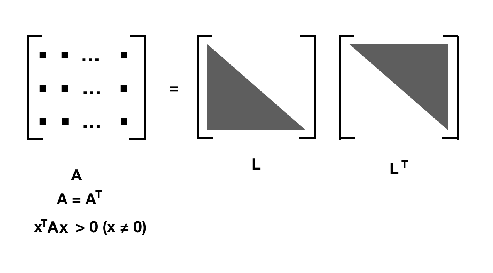

# Cholesky分解 {Cholesky decomposition}

Cholesky 应该怎么念，o(╯□╰)o，听别人念比较像‘瞅乐死骑’，毕竟这是🇫🇷名字，哈哈哈哈

## $A^{T}A$


这个矩阵非常重要，之前在[最小二乘法](https://zhuanlan.zhihu.com/p/89373759)也见过它，如果：

$$A\mathbf{x} = \mathbf{b}$$

无解，也就是 $x= A^{-1}\mathbf{b}$ 不成立， A 不可逆，我们无法计算 $A^{-1}$.


那么我们会想要最小化：

$$||A\mathbf{x} - \mathbf{b} ||_2$$

也就是：


\begin{align*}
|| A\mathbf{x} - \mathbf{b} ||^2 {}
&= (A\mathbf{x} - \mathbf{b})\cdot(A\mathbf{x} - \mathbf{b}) \\
&= (A\mathbf{x} - \mathbf{b})^T \cdot (A\mathbf{x} - \mathbf{b}) \\
&= (\mathbf{x}^TA^T - \mathbf{b}^T) \cdot (A\mathbf{x} - \mathbf{b})\\
&= (\mathbf{x}^TA^TA\mathbf{x} - 2\mathbf{b}^TA\mathbf{x} + \mathbf{b}^T\mathbf{b}) 
\end{align*}


这个 Error 函数对 $\mathbf{x}$ 求导：

$$
\frac{\partial E}{\partial \mathbf{x}} =  2A^TA\mathbf{x} - 2 A^T \mathbf{b}= 0
$$

也就是需要解：

$$
A^TA\mathbf{x} = A^T \mathbf{b} \tag{1}
$$

(1)详细推导过程可以参见：[least\_squares\_SP](http://eeweb.poly.edu/iselesni/lecture_notes/least_squares/least_squares_SP.pdf)


(1)式也就是：

$$
\mathbf{x} = (A^TA)^{-1} A^T \mathbf{b}  \tag{2}
$$


(1)式 一定可以推出 (2) 式么？ $(A^TA)^{-1}$ 一定存在逆矩阵么？也许不一定,不一定的原因是比如 A 不是方阵，那么 $A^TA$ 就可能只是半正定，所以逆矩阵不存在，所以才有[Tikhonov regularization](https://en.wikipedia.org/wiki/Tikhonov_regularization)


## 对称

对称，首先 $A^TA$ 是对称阵，记得 $(AB)^T = B^TA^T$：

$$(A^TA)^T  = A^T (A^T)^T = A^TA$$

它的转置等于自身，所以对称。

## 正定矩阵

先看定义：

$$
{\displaystyle M{\text{为正定矩阵}}\quad \iff \quad x^{\textsf {T}}Mx>0{\text{ for all }}x\in \mathbb {R} ^{n}\setminus \mathbf {0} }
$$

$$
{\displaystyle M{\text{为半正定矩阵}}\quad \iff \quad x^{\textsf {T}}Mx \ge 0{\text{ for all }}x\in \mathbb {R} ^{n}}
$$

这里的 A 我们暂时只考虑它是实数矩阵内，如果A是满秩的方阵，那么 $A^TA$ 为正定矩阵:

$$x^TA^TAx = (Ax)^T \cdot Ax = ||Ax||^2$$

对于实正定矩阵，我们可以有Cholesky分解。


## Cholesky分解


当 A 是一个SPD (real Symmetric positive definite matrix）的时候，注意这里的A 不是上面的 A（只是我用了同一个字母），就可以分解成 lower triangle 矩阵 L 和它的转置也就是 upper triangle $L^T$.




可以用归纳法证明这个分解是一定存在并且是唯一的，可以参见：

[How to prove the existence and uniqueness of Cholesky decomposition?](https://math.stackexchange.com/questions/2509810/how-to-prove-the-existence-and-uniqueness-of-cholesky-decomposition)


之前的高斯消元法中我们写过：

$$
A = PLU
$$


当A正定的时候：

$$
A = LL^T
$$

在实际中，如果矩阵是正定的，使用 Cholesky分解 会比 LU分解 更加高效，更加数值稳定。

## 计算

$$
\begin{aligned}
\left({\begin{array}{*{3}{r}}4&12&-16\\12&37&-43\\-16&-43&98\\\end{array}}\right)=\left({\begin{array}{*{3}{r}}2&0&0\\6&1&0\\-8&5&3\\\end{array}}\right)\left({\begin{array}{*{3}{r}}2&6&-8\\0&1&5\\0&0&3\\\end{array}}\right)
\end{aligned}
$$


计算的话，我们可以用 `scipy.linalg.cholesky`


```python
import numpy as np
from scipy import linalg

a = np.array([[4, 12, -16],
              [12, 37, -43],
              [-16, -43, 98]])
              
L = linalg.cholesky(a, lower=True) # 默认计算 upper， 所以指定 lower = True

# array([[ 2.,  0.,  0.],
#       [ 6.,  1.,  0.],
#       [-8.,  5.,  3.]])

np.allclose(np.dot(L, L.T) , a) # 验证计算
```
