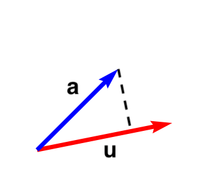
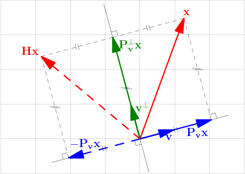

# QR 分解
任何的实方阵都可以做QR分解：

$$A = QR$$

其中 Q 是正交阵， R 是 upper triangle 矩阵.

Q 作为正交矩阵，有很多很好的特性：

- $QQ^T = I$
- det(Q) = ±1, 如果 det(Q) = 1 则为旋转变换，说起旋转变换又会想到SO(n) 李群和李代数
- 可以给我们提供一组正交基


## Gram-Schmidt

我们可以通过Gram–Schmidt来计算Q:

首先定义projection 操作：

$$\operatorname {proj} _{\mathbf {u} }\mathbf {a} ={\frac {\left\langle \mathbf {u} ,\mathbf {a} \right\rangle }{\left\langle \mathbf {u} ,\mathbf {u} \right\rangle }}{\mathbf {u} }$$

也就是把 $\mathbf{a}$ 投影到 $\mathbf{u}$ 方向上。




假设 $A=\left[\mathbf {a} _{1},\ldots ,\mathbf {a} _{n}\right]$, 那么可以找到一组正交基：

$$
\begin{aligned}
\mathbf {u} _{1}&=\mathbf {a} _{1},&\mathbf {e} _{1}&={\mathbf {u} _{1} \over \|\mathbf {u} _{1}\|}\\\mathbf {u} _{2}&=\mathbf {a} _{2}-\operatorname {proj} _{\mathbf {u} _{1}}\,\mathbf {a} _{2},&\mathbf {e} _{2}&={\mathbf {u} _{2} \over \|\mathbf {u} _{2}\|}\\\mathbf {u} _{3}&=\mathbf {a} _{3}-\operatorname {proj} _{\mathbf {u} _{1}}\,\mathbf {a} _{3}-\operatorname {proj} _{\mathbf {u} _{2}}\,\mathbf {a} _{3},&\mathbf {e} _{3}&={\mathbf {u} _{3} \over \|\mathbf {u} _{3}\|}\\&\vdots &&\vdots \\\mathbf {u} _{k}&=\mathbf {a} _{k}-\sum _{j=1}^{k-1}\operatorname {proj} _{\mathbf {u} _{j}}\,\mathbf {a} _{k},&\mathbf {e} _{k}&={\mathbf {u} _{k} \over \|\mathbf {u} _{k}\|}
\end{aligned}
$$

A 可以表示为：

$$
\begin{aligned}
\mathbf {a} _{1}&=\langle \mathbf {e} _{1},\mathbf {a} _{1}\rangle \mathbf {e} _{1}\\\mathbf {a} _{2}&=\langle \mathbf {e} _{1},\mathbf {a} _{2}\rangle \mathbf {e} _{1}+\langle \mathbf {e} _{2},\mathbf {a} _{2}\rangle \mathbf {e} _{2}\\\mathbf {a} _{3}&=\langle \mathbf {e} _{1},\mathbf {a} _{3}\rangle \mathbf {e} _{1}+\langle \mathbf {e} _{2},\mathbf {a} _{3}\rangle \mathbf {e} _{2}+\langle \mathbf {e} _{3},\mathbf {a} _{3}\rangle \mathbf {e} _{3}\\&\vdots \\\mathbf {a} _{k}&=\sum _{j=1}^{k}\langle \mathbf {e} _{j},\mathbf {a} _{k}\rangle \mathbf {e} _{j}
\end{aligned}
$$


所以有：

$$Q=\left[\mathbf {e} _{1},\ldots ,\mathbf {e} _{n}\right]$$


$$
R = \begin{pmatrix}\langle \mathbf {e} _{1},\mathbf {a} _{1}\rangle &\langle \mathbf {e} _{1},\mathbf {a} _{2}\rangle &\langle \mathbf {e} _{1},\mathbf {a} _{3}\rangle &\ldots \\0&\langle \mathbf {e} _{2},\mathbf {a} _{2}\rangle &\langle \mathbf {e} _{2},\mathbf {a} _{3}\rangle &\ldots \\0&0&\langle \mathbf {e} _{3},\mathbf {a} _{3}\rangle &\ldots \\\vdots &\vdots &\vdots &\ddots \end{pmatrix}
$$


这个 R 为上三角矩阵由上面的计算过程看起来是一目了然，实际上我们动脑想一想也会觉得很清楚，因为 $\mathbf{a}_{1}$  定义了 $\mathbf{e}_{1}$ ，而  $\mathbf{a} _{2}$ 则完全由  $\mathbf{e}_{1},  \mathbf{e}_{2}$  确定， $\mathbf{a}_{k}$ 只会由  $\mathbf{e}_{1} \cdots \mathbf {e}_{k}$  确定，所以当然就是上三角的。

不过实际上， Gram-Schmidt 计算方式并不是很数值稳定，想象一下矩阵：$\begin{pmatrix} 1 & 1 +  \varepsilon \\ 1 & 1\end{pmatrix}, \varepsilon  \ll 1$,其实计算过程可能会出很大的问题。因为除以一个极小的数可能会带来很多无效数据。

## Householder变换
 
projection 我们也可以写成矩阵形式：

$$\operatorname {proj} _{\mathbf {u} }\mathbf {a} ={\frac {\left\langle \mathbf {u} ,\mathbf {a} \right\rangle }{\left\langle \mathbf {u} ,\mathbf {u} \right\rangle }}{\mathbf {u} }$$

$$
\operatorname {proj} _{\mathbf {u} }\mathbf {a} = {\frac  {\mathbf {u}^T \cdot \mathbf {a} }{\mathbf {u}^T \cdot \mathbf {u} }} \cdot  {\mathbf {u} }  =  {\frac  { (\mathbf {u}^T \cdot \mathbf {a})  \cdot \mathbf {u}  }{\mathbf {u}^T \cdot \mathbf {u} }}
$$

点乘复合交换律和结合律，所以我们可以继续写成：

$$
\operatorname {proj} _{\mathbf {u} }\mathbf {a} =  {\frac  { \mathbf {u}\cdot \mathbf {u}^T  \cdot \mathbf {a}  }{\mathbf {u}^T \cdot \mathbf {u} }}
$$

这里 $\mathbf {u}\cdot \mathbf {u}^T$ 是一个 3 x 3 的矩阵，所以

$$
P =  {\frac  { \mathbf {u}\cdot \mathbf {u}^T  }{\mathbf {u}^T \cdot \mathbf {u} }}
$$

又称作投影的矩阵形式。它本身也有一些特性，比如对称、比如$P^2 = P$....

接着来看反射操作：



$$
\begin{aligned}
\mathbf {b} - 2 \operatorname {proj} _{\mathbf {u} }\mathbf {b} {}
&= \mathbf {b} - 2 {\frac {\left\langle \mathbf {u} ,\mathbf {b} \right\rangle }{\left\langle \mathbf {u} ,\mathbf {u} \right\rangle }}{\mathbf {u} } \\
&= \mathbf {b} - 2 {\frac  { \mathbf {u}\cdot \mathbf {u}^T  }{\mathbf {u}^T \cdot \mathbf {u} }} \mathbf{b}\\
&=  ( I - 2 {\frac  { \mathbf {u}\cdot \mathbf {u}^T  }{\mathbf {u}^T \cdot \mathbf {u} })} \mathbf{b}\\
&= H_u\mathbf{b} 
\end{aligned}
$$

我们有反射矩阵：

$$
H_u = I - 2 {\frac  { \mathbf {u}\cdot \mathbf {u}^T  }{\mathbf {u}^T \cdot \mathbf {u} } } 
$$

为什么要引入这个反射矩阵？

wikipedia 上有关于这个矩阵的说法：

> 豪斯霍尔德变换可以将向量的某些元素置零，同时保持该向量的范数不变。
> 
> 将非零列向量 $\mathbf{x}=[x_1,\ldots,x_n ]^T$ 变换为单位基向量$\mathbf{e}=[1,0,\ldots,0]^T$ 的豪斯霍尔德矩阵为
> 
> $\mathbf{H} = \mathbf{I} - \frac{2}{\langle \mathbf{v},\mathbf{v} \rangle}\mathbf{vv}^H$
> 
> 其中豪斯霍尔德向量$\mathbf{v}$满足：
> 
> $\mathbf{v} = \mathbf{x} + \rm{sign}(x_1) \Vert x \Vert_2 \mathbf{e}_1 . \,$


这个矩阵有特性包括：

-  $H^{T}=H$
-  $H^{-1}=H$
-  $H^{2}=I$


假设 $\mathbf{a}$ 是矩阵 A 的第一列， 有 $H_u$ :

$$
c\mathbf{e}_1 = H_u \mathbf{a}
$$


也就做完这个操作可做到：

$$
\begin{pmatrix} x & x & x & x\\
x & x & x & x\\
x & x & x & x\\
x & x & x & x \end{pmatrix} \to
\begin{pmatrix} 1 & x & x & x\\
0 & x & x & x\\
0 & x & x & x\\
0 & x & x & x \end{pmatrix} 
$$


这就是我们高斯消元法做的第一步，这也是让我们朝着上三角迈进的第一步。 我们可以继续执行，最终我们可以得到上三角矩阵：

$$
R = H_{u_n} \cdots H_{u_1}A \\
Q = H_{u_1}^T \cdots H_{u_n}^T
$$

Gram-Schmidt 和 Householder 对于 $A^{m \times n}$ 分解会有稍许不同：


- Gram-Schmidt : $Q \in R^{m \times n}, R \in R^{n \times n}$
- Householder: $Q \in R^{m \times m}, R \in R^{m \times n}$


在计算中，Householder 的数值稳定性会稍优于 Gram-Schmidt.

## 计算

$$
A={\begin{pmatrix}12&-51&4\\6&167&-68\\-4&24&-41\end{pmatrix}}
$$

$$
Q={\begin{pmatrix}0.8571&-0.3943&0.3314\\0.4286&0.9029&-0.0343\\-0.2857&0.1714&0.9429\end{pmatrix}}$$


$$
R= \begin{pmatrix}14&21&-14\\0&175&-70\\0&0&-35\end{pmatrix}
$$


同样，QR 分解直接 `scipy.linalg.qr`:

```python
import numpy as np
from scipy import linalg

a = np.array([[12, -51, 4],
              [6, 167, -68],
              [-4, 24, -41]])
              
q, r = linalg.qr(a)

q
# array([[-0.85714286,  0.39428571,  0.33142857],
#       [-0.42857143, -0.90285714, -0.03428571],
#       [ 0.28571429, -0.17142857,  0.94285714]])

r 
# array([[ -14.,  -21.,   14.],
#       [   0., -175.,   70.],
#       [   0.,    0.,  -35.]])

np.allclose(np.dot(q, r), a) # True
```

符号不一样仅仅只是我们基 $\mathbf{e}_1\cdots \mathbf{e}_n$ 的方向选择.


A = QR 的抗干扰性总觉得不是很好，即使A只有微小的变化，QR 也会剧烈改变。