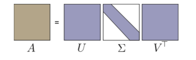
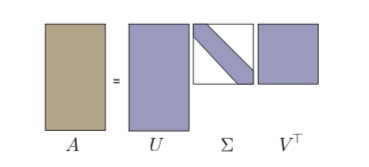
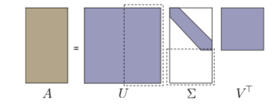
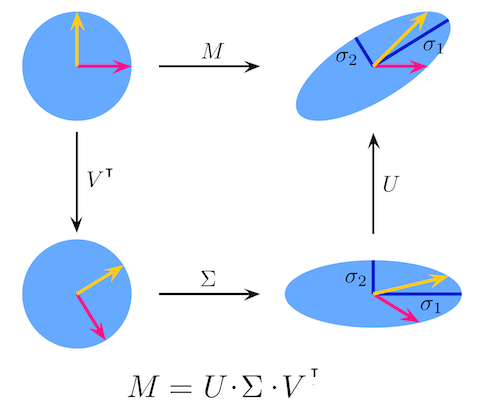

# 奇异值分解 {SVD decomposition}

## 引入

首先我们来看 SVD 的引入（？证明（？，最直观的看法是比如我们想看变换 $A\vec{x}$ 对向量 $\vec{x}$ 造成的影响，至少我们来看对于模长的影响：

$$
R(\vec{x}) = \frac{\parallel A\vec{x}\parallel _2}{\parallel \vec{x}\parallel _2}
$$


首先可以注意的是：

$$
R(\alpha \vec{x}) = \frac{\parallel A \alpha \vec{x}\parallel _2}{\parallel \alpha \vec{x}\parallel _2} = \frac{\parallel \alpha\parallel  \cdot \parallel A  \vec{x}\parallel _2}{\parallel \alpha \parallel  \cdot \parallel \vec{x}\parallel _2} = \frac{\parallel A\vec{x}\parallel _2}{\parallel \vec{x}\parallel _2}
$$

- $R(\alpha \vec{x})  = R(\vec{x})$ ，说明研究单位向量 $\parallel \vec{x}\parallel _2 = 1$ 足矣
- $R(\vec{x})  \ge 0$， 研究 $R^2(\vec{x})$ 也一样

来看一下对向量模缩放的极值,用朗格朗日乘子法：

$$
L(\vec{x}) = (A\vec{x})^2 - \lambda(\vec{x}^2 - 1)
$$

求导，看极值，依旧是我们熟悉的形式：

$$
(A^TA)\vec{x}_i = \lambda_i\vec{x}_i \tag{1}
$$


我们想要看 $A\vec{x}$ 对 $\vec{x}$ 的模的 影响，不过出现的极值对应的是 $A^TA$ 的特征值 o(╯□╰)o

这个特殊的矩阵具有的性质包括：

- $\lambda_i \ge 0 \forall i$, 这里很容易理解，因为 $A^TA$ 是实对称的，是正定的
- 这个矩阵的基是一组完整的正交组


我们更想知道的是变换与 A 的关系。对于 $A^TA$ 的特征向量 $\vec{x}_i$, 考虑： $\vec{y}_i = A \vec{x}_i$， 我们可以证明：

**$\vec{y}_i$ 要么是 $\vec{0}$， 要么是 $AA^T$ 的特征向量。** 

注意上面我们查看极值处出现的是 $A^TA$, 而 $\vec{y}$ 对应的是 $AA^T$, 一般情况下，他们是不同的，一个很简单的问题就是比如 $A \in \mathbb{R}^{m \times n}$, 那么 $AA^T \in \mathbb{R}^{m \times m}$, $A^TA \in \mathbb{R}^{n \times n}$.


又或者即使 $A \in \mathbb{R}^{n \times n}$ 也容易肉眼验证 $AA^T$ 和 $A^TA$ 是不一样的:

```
>>> import numpy as np
>>> a = np.random.rand(3,3)
>>> a
array([[0.73741709, 0.2207241 , 0.60793118],
       [0.00490906, 0.18066958, 0.44795408],
       [0.70657397, 0.5650763 , 0.29043162]])
>>> aat = np.dot(a, a.T)
>>> aat
array([[0.96208341, 0.31582341, 0.82232812],
       [0.31582341, 0.23332846, 0.23566075],
       [0.82232812, 0.23566075, 0.90290852]])
>>> ata = np.dot(a.T, a)
>>> ata
array([[1.04305484, 0.56292085, 0.6557093 ],
       [0.56292085, 0.40067186, 0.37923277],
       [0.6557093 , 0.37923277, 0.6545937 ]])
>>> np.allclose(aat, ata)
False
>>> from scipy import linalg
>>> linalg.eigvals(aat)
array([1.84996505+0.j, 0.0737421 +0.j, 0.17461325+0.j])
>>> linalg.eigvals(ata)
array([1.84996505+0.j, 0.0737421 +0.j, 0.17461325+0.j])
```

不过 $AA^T$ 和 $A^TA$ 的特征值看起来算出来一样，实际上这是一个可以推广的结论：

**$A, B \in \mathbb{R}^{n \times n}, AB$ 和 $BA$ 特征值一样**.

一个简单的证明如下：

$$AB\vec{x} = \lambda \vec{x}$$

令 $\vec{y} = B\vec{x}$, 那么（当然我们这里考虑的都是 $\lambda \ne 0, \vec{x} \ne 0$)


$$B A \vec{y} = BAB\vec{x} = B \lambda \vec{x} = \lambda B \vec{x} = \lambda \vec{y} $$

回到 **$\vec{y}_i = A \vec{x}_i，\vec{y}_i$ 要么是 $\vec{0}$， 要么是 $AA^T$ 的特征向量。** 

证明：

$$
\begin{aligned}
\lambda_i \vec{y_i} {}
&= \lambda_i A\vec{x_i}\\
&= A (\lambda_i \vec{x_i}) \\
&= A (A^TA \vec{x_i}) & \text{from (1)}\\ 
&= (AA^T) \vec{y}_i & \text{(2)} \\ 
\end{aligned} 
$$

所以 $\vec{y}_i$ 是 $AA^T$ 对应的特征向量，并且：


$$
\begin{aligned}
\parallel \vec{y_i}\parallel  {}
&= \parallel  A\vec{x_i}\parallel  \\
&= \sqrt{ \parallel  \lambda_i A\vec{x_i}\parallel  ^2}\\
&= \sqrt{ \vec{x}_i^T A^T A \vec{x}_i} \\
&= \sqrt{ \vec{x}_i^T A^T A \vec{x}_i} \\ 
&= \sqrt{ \vec{x}_i^T \lambda_i \vec{x}_i} & \text{from (1)} \\
&= \sqrt{  \lambda_i \vec{x}_i^T \vec{x}_i} \\
&= \sqrt{  \lambda_i} \parallel \vec{x}_i\parallel  \\
\end{aligned}
$$


如果 $\lambda_i = 0, \vec{y}_i = \vec{0}$, 所以这就证明了我们的说法： **$\vec{y}_i$ 要么是 $\vec{0}$， 要么是 $AA^T$ 的特征向量，并且 $\parallel \vec{y_i}\parallel  = \sqrt{  \lambda_i} \parallel \vec{x}_i\parallel$.**


现在我们继续 k 是 $A^TA$ 大于 0 的特征值数量，对应的特征值是 $\lambda_1, \cdots, \lambda_k$, 对应的特征向量是 $\vec{x}_1, \cdots, \vec{x}_k \in \mathbb{R}^n$, 我们又知道 $AA^T$ 和 $A^TA$ 的特征值一样，所以有：

$$
k = \text{number of} \lambda_i > 0 \\
A^TA \vec{x}_i = \lambda_i \vec{x}_i \\
AA^T \vec{y}_i = \lambda_i \vec{y}_i \\
$$

我们假设 $\parallel \vec{x}_i\parallel  = 1$, 取 

$$\vec{y}_i = \frac{1}{\sqrt{\lambda_i}} A \vec{x}_i  \tag{3}$$ 

可以证明：

$$
\parallel \vec{y}_i\parallel  = \frac{1}{\sqrt{\lambda}} \parallel A\vec{x}_i \parallel  = \frac{1}{\sqrt{\lambda}} \sqrt{\lambda} \parallel \vec{x}_i\parallel  = 1
$$

所以如果 $\vec{x}_i$ 都是单位向量的话， $\vec{y}_i$ 也是， 所以我们可以取

$$
\bar{V} = \begin{pmatrix} \vec{x}_1 & \cdots & \vec{x}_k \end{pmatrix}  \in \mathbb{R}^{n \times k} \\
\bar{U} = \begin{pmatrix} \vec{y}_1 & \cdots & \vec{y}_k \end{pmatrix} \in \mathbb{R}^{m \times k}
$$


令 $\vec{e}_1$ 为第 i 个标准正交基向量，则：


$$
\begin{aligned}
\bar{U}^T A \bar{V} \vec{e}_1{} &=  \bar{U}^T A \vec{x}_i & \bar{V} \text{ defination} \\
&=  \frac{1}{\lambda_i} \bar{U}^T A (\lambda_i \vec{x}_i) \\
&= \frac{1}{\lambda_i} \bar{U}^T A (A^TA \vec{x}_i)  & \text{ from (1)} \\
&= \frac{1}{\lambda_i} \bar{U}^T (AA^T) A \vec{x}_i \\
&= \frac{1}{\sqrt{\lambda_i}} \bar{U}^T (AA^T) \vec{y}_i & \text{from (3)}\\ 
&= \frac{1}{\sqrt{\lambda_i}} \bar{U}^T \lambda_i \vec{y}_i & \text{from (2)}  \\
&= \sqrt{\lambda_i}  \bar{U}^T  \vec{y}_i \\
&= \sqrt{\lambda_i}\vec{e}_i \\
\end{aligned}
$$

令  $\Sigma = diag (\sqrt{\lambda_1}, \cdots, \sqrt{\lambda_k})$,所以：

$$\bar{U}^T A \bar{V} = \Sigma$$

再回首看一下这个结论，那就是：

$$\bar{U} \in \mathbb{R}^{m \times k},  \bar{V} \in \mathbb{R}^{n \times k},  A \in \mathbb{R}^{m \times n}, \Sigma \in \mathbb{R}^{k \times k} $$

但是 $\bar{U}, \bar{V}$ 不是方阵， 我们可以添加一些基，使得 $A^TA\vec{x}_i = \vec{0}$ 和 $AA^T\vec{y}_i = \vec{0}$, 这样 $\bar{U}, \bar{V}$ 也就变成了方阵，满足：

$$\bar{U} \in \mathbb{R}^{m \times k},  \bar{V} \in \mathbb{R}^{n \times k}\mapsto U \in \mathbb{R}^{m \times m}, V \in \mathbb{R}^{n \times n} $$

同时 $\Sigma$ 对角也会变成：

$$
\Sigma_{ij} = \begin{cases}
\sqrt{\lambda}_i & i = j, i \le k\\
0 & \text{otherwise}
\end{cases}
$$

这样我们可以写出：

$$A = U \Sigma V^T$$

**终于，至此我们推导出奇异值分解， $A = U \Sigma V^T$， 我们没有给 A 加上任何条件，它无需对称、无需正定、无需是实数。这就是奇异值分解。**

方阵的奇异值分解：



非方阵的跟据我们上面的推导，可以写成这种紧凑型的：



也可以填0把 U、V 都写成方阵：



**如果你拿到任何矩阵而毫无头绪，你总可以尝试奇异值分解。**

## 理解

$$A = U \Sigma V^T$$

- 左奇异向量（left singular vector) : U 的列， span col A
- 右奇异向量（right singular vector）: V 的列， span row A (注意这里是V而不是$V^T$）
- 奇异值(singular value): $\Sigma$ 的对角线，满足 $\sigma_1 \ge \sigma_2 \cdots \ge 0$

SVD  =  方阵 x 对角阵 x 方阵， 一个方阵中包含了A的列向量的信息，另一个方阵中包含了A的行向量的信息。

其实我一直有一个疑惑就是为什么这个叫 singular value decompostion, 因为 non-invertable 的 矩阵也叫 singular 矩阵（invertible 也叫 nonsingular)，查询后知道，原来singular 有几个意思： single（单个）、special（特别/不常见）的意思。

如果我们取 n x n 随机矩阵 R 的话，基本上都是不可逆的，用 singular 表示它处理起来比较麻烦，特别，当然你也可以记成它单身，找不到伴 $R^{-1}$, 而 singular value decompostion 则一定就是 我们把这个矩阵做了特殊分解了吧，o(╯□╰)o


注意 特征分解 和 奇异分解 的不同：

> 这两种矩阵分解尽管有其相关性，但还是有明显的不同。对称阵特征向量分解的基础是谱分析，而奇异值分解则是谱分析理论在任意矩阵上的推广。


为什么 SVD 这么引入注意？

因为我们可以把 SVD 这样来理解：

- $V^T$ : 旋转
- $\Sigma$ : 缩放
- U : 旋转

意思是任何矩阵\\变换总可以看成 旋转 + 缩放 + 旋转。



## 计算

1. V 是 $A^TA$ 的特征向量
2. $AV = U \Sigma$， 非0 奇异值对应的 $\vec{u}_i$ 为 $AV$ 标准化的列
3. $AA^T\vec{u}_i = 0$ 可以解除剩下的 

## 应用


### 例子一

如果我们已经有了 A 的 SVD 分解，我们可以简化很多事：

$$A = U \Sigma V^T$$


我们可以相应知道 $A^{-1}$， 当然前提 A 可逆（nonsingular 好绕):


$$
\begin{aligned}
A^{-1} {}
&=  (U \Sigma V^T)^{-1} \\
&= (V^T)^{-1} \Sigma^{-1} U^{-1} \\
&= V \begin{pmatrix} \sigma_1  & & \\ & \ddots &  \\  & & \sigma_n \end{pmatrix}^{-1} U^{-1} \\
&= V \begin{pmatrix} \frac{1}{\sigma_1}  & & \\ & \ddots &  \\  & & \frac{1}{\sigma_n} \end{pmatrix} U^T \\
\end{aligned}
$$

这个很容易解， 方阵的转置是它的逆， 对角的逆直接是它每个对角元素的倒数。

容易解$A\vec{x}= \vec{b}$：

$$
\begin{aligned}
A\vec{x} {}
&= \vec{b} \\
U \Sigma V^T \vec{x} &= \vec{b}\\
\vec{x} &= V \Sigma^{-1} U^T \vec{b}  \\
\end{aligned}
$$


### 例子二

我们已经遇到过很多次这样的 setup 了：

$$
\text{minimize } \parallel \vec{x}\parallel _2^2 \\
\text{such that  } A^TA\vec{x} = A^T \vec{b}
$$

计算 $A^TA$:

$$
\begin{aligned}
A^T A {}
&= (U \Sigma V^T)^T(U \Sigma V^T) \\
&= V \Sigma U^T U \Sigma V^T\\
&= V \Sigma^2 V^T \\
\end{aligned}
$$

所以 $A^TA \vec{x} = A^T \vec{b}$ 可以写成：


$$
\begin{aligned}
A^TA \vec{x} = A^T \vec{b}  \iff V \Sigma^2 V^T \vec{x} &= (U \Sigma V^T)^T \vec{b}\\ {}
V \Sigma^2 V^T \vec{x} &= V \Sigma U^T \vec{b} \\
\Sigma V^T \vec{x} &=  U^T \vec{b}
\end{aligned}
$$

可以写成： 


$$
\begin{aligned}
A^TA \vec{x} = A^T \vec{b}  \iff \Sigma \vec{y} &= \vec{d} \\ {}
\vec{y} &= V^T \vec{x} \\
\vec{d} &=  U^T \vec{b}
\end{aligned}
$$

上面的setup就可以改成：

$$
\text{minimize } \parallel \vec{y}\parallel _2^2 \\
\text{such that  } \Sigma \vec{y} =  \vec{d}
$$

$\vec{y} = V^T \vec{x}$ 这个变换是一个旋转，所以当然对模长没有影响。

上面的 setup 由 $\vec{x}$ 变成了 $\vec{y}$， 那么有意思的地方也就出现了, $\Sigma$ 是一个对角阵，所以：

$$
\begin{pmatrix} \sigma_1  & & \\ & \ddots &  \\  & & \sigma_k & \\ & & & 0 \end{pmatrix} 
\begin{pmatrix} y_1 \\  \vdots \\  \\  y_n \end{pmatrix} 
= \begin{pmatrix} d_1 \\ \vdots  \\ \\ d_m\end{pmatrix}
$$

所以可以设置:

$$
\Sigma_{ij}^+ =  \begin{cases}
\frac{1}{\sigma}_i & i = j, \sigma_i \ne 0,  i \le k\\
0 & \text{otherwise}
\end{cases} \\
\implies \vec{y} = \Sigma_{ij}^+ \vec{d} \\
\implies \vec{x} = V \Sigma_{ij}^+ U^T \vec{b}
$$

这个矩阵 $V \Sigma_{ij}^+ U^T$ 还有一个专门的名字： Pseudoinverse（伪逆?）,它有一些性质 ： 

- A square and invertible ⇒ $A^+ = A^{−1}$
- A overdetermined ⇒ $A^+\vec{b}$ gives least-squares solution to $A\vec{x} = \vec{b}$
- A underdetermined ⇒$A^+\vec{b}$ gives least-squares solution to $A\vec{x} = \vec{b}$ with least (Euclidean) norm

### 例子三

A 的另一种写法：

$$A = U \Sigma V^T \implies A = \sum_{i = 1}^l \sigma_i \vec{u}_i \vec{v}_i^T\\
l = \text{min}\{ m, n\}$$


上面这种看法/写法很有意思。我们把 A 看成是 列向量 x 行向量 的和。

注意 $\vec{u} \vec{v}^T$ 又被定义为外积:

$$\vec{u} \otimes \vec{v} = \vec{u} \vec{v}^T$$

计算 $A\vec{x}$ :

$$A\vec{x} = \sum_i \sigma_i (\vec{v}_i \cdot \vec{x}) \vec{u}_i$$

这个写法给我们一些提示，那就是计算 $A\vec{x}$ 我们可以 忽略很小的 $\sigma_i$

同时 $A^+\vec{x}$ 可以：

$$A^+ = \sum_{\sigma_i \ne 0} \frac{\vec{v}_i \cdot \vec{u}^T}{\sigma_i }$$

计算 $A^+$ 可以忽略 很大的 $\sigma_i$ 

实际上有个定理 **Eckart-Yound Theorem（低维矩阵近似）**:

> Suppose $\widetilde{A}$ is obtained from $A = U\Sigma V^T$ by truncating all but the k largest singular values $\sigma_i$ of A to zero. Then,$\widetilde{A}$  minimizes both
$\parallel A - \widetilde{A} \parallel _{Fbo}$ and $\parallel A - \widetilde{A} \parallel _2$ subject to the constraint that the column space of  $\tilde{A}$ has at most dimension k.


意思就是 从 A 找到一个 rank 为 r 的矩阵 $\widetilde{A}$， 这个矩阵可以最小化与 A 之间的 Frobenius norm 和 2-norm, 这个 $\widetilde{A}$ 是如何找到的呢？ 就是我们用 SVD 将 A 分解成 $A = U\Sigma V^T$ ， 人然后 $\Sigma$ 中最 k 个最大的 非0 奇异值。

Frobenius norm 的定义是：

$$
{\displaystyle \|A\|_{\text{F}}={\sqrt {\sum _{i=1}^{m}\sum _{j=1}^{n}|a_{ij}|^{2}}}={\sqrt {\operatorname {trace} \left(A^{*}A\right)}}={\sqrt {\sum _{i=1}^{\min\{m,n\}}\sigma _{i}^{2}(A)}}}
$$

这样当然是最小化啦，

2-norm 对矩阵的定义是：

$${\displaystyle \parallel A\parallel _2 = \max _{{\vec {v}}\neq {\vec {0}}}{\frac {\parallel A{\vec {v}}\parallel _{2}}{\parallel {\vec {v}}\parallel _{2}}}} = \text{max} \{ \sigma_i \}$$

这也很容易理解，因为$A = U \Sigma V^T$ 旋转，缩放 ，旋转， 改变长度的只有缩放$\Sigma$， 而$\sigma_i \ge 0$ 这个又是很显然的。(The singular values are non-negative real numbers.) 这个显然可以显然在上面的引入部分 $\Sigma = diag (\sqrt{\lambda_1}, \cdots, \sqrt{\lambda_k})$

实际上我们的奇异值也 $A^TA $ 的特征根开根号， 而 $A^TA$ 为正定，所以必定奇异值非负。


## 例子

考虑 M:

$$\mathbf {M} ={\begin{bmatrix}1&0&0&0&2\\0&0&3&0&0\\0&0&0&0&0\\0&2&0&0&0\end{bmatrix}}$$

对 M 做 奇异值分解的话： $UΣV^*$:

$$
U = \begin{bmatrix} 0 & -1 & 0 & 0 \\ -1 & 0 & 0 & 0 \\ 0 & 0 & 0 & -1 \\ 0 & 0 & -1 & 0\end{bmatrix} \\
\Sigma = \begin{bmatrix} 3 & 0 & 0 & 0 & 0 \\ 0 & \sqrt{5} & 0 & 0 & 0 \\ 0 & 0 & 2 & 0 & 0 \\ 0 & 0 & 0 & 0 & 0\end{bmatrix}  \\
V^* = \begin{bmatrix} 0 & 0 & -1 & 0 & 0 \\ -\sqrt{0.2} & 0 & 0 & 0 & -\sqrt{0.8} \\ 0 & -1 & 0 & 0 & 0 \\ 0 & 0 & 0 & 1 & 0  \\ -\sqrt{0.8} & 0 & 0 & 0 & \sqrt{0.2} \end{bmatrix} \\
$$


```python
>>> from scipy import linalg
>>> import numpy as np
>>>
>>> a = np.array([[1, 0, 0, 0, 2],
...               [0, 0, 3, 0, 0],
...               [0, 0, 0, 0, 0],
...               [0, 2, 0, 0, 0]])
>>>
>>> u, s, vh = linalg.svd(a)
>>>
>>> u
array([[ 0.,  1.,  0.,  0.],
       [ 1.,  0.,  0.,  0.],
       [ 0.,  0.,  0., -1.],
       [ 0.,  0.,  1.,  0.]])
>>> s
array([3.        , 2.23606798, 2.        , 0.        ])
>>> vh
array([[-0.        ,  0.        ,  1.        , -0.        ,  0.        ],
       [ 0.4472136 ,  0.        ,  0.        ,  0.        ,  0.89442719],
       [-0.        ,  1.        ,  0.        , -0.        ,  0.        ],
       [ 0.        ,  0.        ,  0.        ,  1.        ,  0.        ],
       [-0.89442719,  0.        ,  0.        ,  0.        ,  0.4472136 ]])
```

可以看到这个用 scipy 来解 u 和 vh 跟上面有点区别，就是选择的方向的原因，o(╯□╰)o
