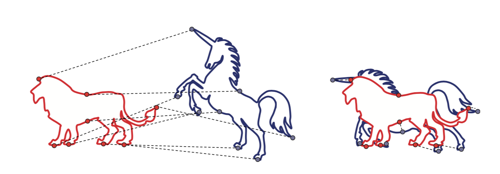
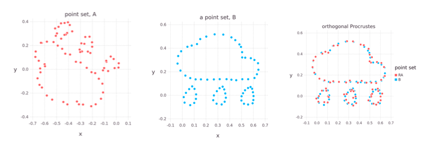
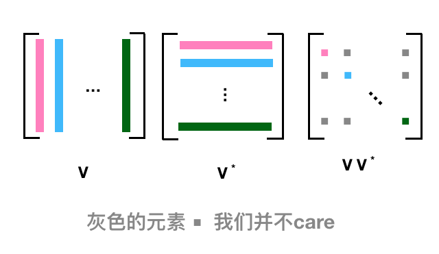
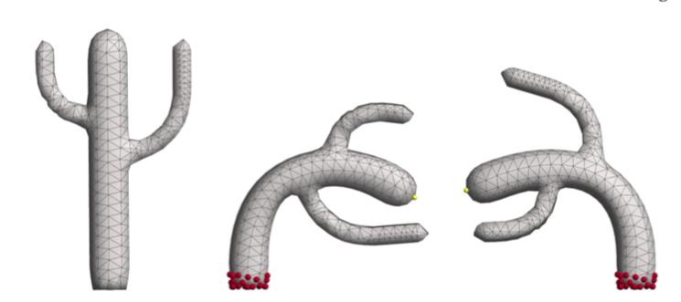
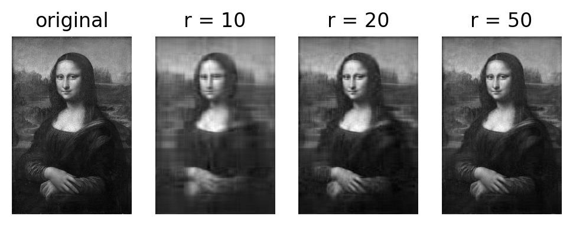

# 奇异值分解的应用 {SVD application}
这里再写一些 SVD 更为具体的应用。

## Rigid Alignment / Procrustes Problem

顾名思义, 比如我们想要这两个形状对齐：



或者比如我们有两个点云，想让它们尽量对齐：



又或者我们3D扫描了一些点云，想要把它们对齐以生成更好的3D point clouds，最终生成更好的 3D mesh，也要用到 Rigid Alignment.


最简单的set up 就是我们有如上图的两个点云, 然后通过平移和旋转，最小化它们之间的距离：

$$
E  = \sum_{i=1}^n \parallel p_i-(Rq_i+  t) \parallel^2 \\
p_i \in P \\
q_i \in Q
$$


平移很容易求到, 让它们的质心重合：


$$
p = \frac{1}{n}\sum_{i=1}^np_i = \frac{1}{n}\sum_{i=1}^n (Rq_i+t) = R \frac{1}{n}\sum_{i=1}^nq_i + t = Rq + t \\
t = p - Rq
$$


质心重合之后我们就只需要最小化对应点之间的距离：


$$
\begin{aligned}
\sum_{i=1}^n \parallel p_i-(Rq_i+t) \parallel^2 &= \sum_{i=1}^n \parallel p_i - Rq_i - (p - Rq) \parallel^2 \\ 
 	&= \sum_{i=1}^n \parallel (p_i -p) - R(q_i -q) \parallel^2
\end{aligned}
$$

$p_i - p$ 和 $q_i - q$ 其实是以质心为坐标来表示 p 和 q， 为了简便，令 $x_i = p_i - p, y_i = q_i - q$, 上式化简：

$$
\begin{aligned}
 \parallel x_i - Ry_i \parallel ^2 &= (x_i - Ry_i)^T(x_i-Ry_i) \\ 
 	&= (x_i^T - y_i^TR^T)(x_i-Ry_i) \\
 	&= (x_i^Tx_i - x_i^TRy_i - y_i^TR^Tx_i + y_i^TR^TRy_i) & (R^TR = I)\\
 	&= (x_i^Tx_i + y_i^Ty_i - x_i^TRy_i - y_i^TR^Tx_i)
\end{aligned}
$$

$x_i^TRy_i$ 是一个标量，因为 $x_i^T$ 是 1xd, R 是 dxd, $y_i$ 是 dx1，然后对于任何标量，我们有 $a^T = a$, 所以：

$$
x_i^TRy_i = (x_i^TRy_i)^T = y_i^TRx_i
$$

继续化简：

$$
\sum_{i=1}^n  \parallel  x_i - Ry_i \parallel^2 =\sum_{i=1}^n  （ x_i^Tx_i + y_i^Ty_i - 2y_i^TRx_i ）
$$


上面这个式子中 $x_i^Tx_i、y_i^Ty_i$ 是固定的， 变换的就是  $\sum_{i=1}^n y_i^TRx_i$

这里为了方便，我们直接这样来看待：

$$
 \sum_{i=1}^n  \parallel  x_i - Ry_i \parallel^2 = \parallel  X - RY \parallel_{Fro}^2 = const - 2tr(Y^T R X)
$$

这里我们用了一些结论：


- $ tr(A + B)  = tr(A) + tr(B)$
- $ tr(A^T) = tr(A)$
- $\parallel A  \parallel_{Fro}^2 = \sum_{i,j} | a_{ij}|^2$
- $tr(AB) = tr(BA)$

$tr(A + B)  = tr(A) + tr(B)$ 和 $ tr(A^T) = tr(A)$ 都肉眼可见的为真。

对于 Frobenius norm， 因为是矩阵中每个元素的模加起来，正好 AA* 对角线上的元素的和, 下面这个图会比较清晰，比如第一列，对应于共轭转置的第一行，正好是 $AA^*$ 对角元素第一个，而我们不 care 除了对角线上的别的元素，所以容易证其正确性：



至于 $tr(AB) = tr(BA)$ 也是可以跟上面一样的看法 $Tr(AB) = Tr (BA) = \sum a_{ij} b_{ji}$， 这个结论也可以推广：

- ${\displaystyle \operatorname {tr} (\mathbf {A} \mathbf {B} \mathbf {C} )=\operatorname {tr} \left(\left(\mathbf {A} \mathbf {B} \mathbf {C} \right)^{\mathsf {T}}\right)=\operatorname {tr} (\mathbf {C} \mathbf {B} \mathbf {A} )=\operatorname {tr} (\mathbf {A} \mathbf {C} \mathbf {B} ),}$
- ${\displaystyle \operatorname {tr} (\mathbf {A} \mathbf {B} \mathbf {C} \mathbf {D} )=\operatorname {tr} (\mathbf {B} \mathbf {C} \mathbf {D} \mathbf {A} )=\operatorname {tr} (\mathbf {C} \mathbf {D} \mathbf {A} \mathbf {B} )=\operatorname {tr} (\mathbf {D} \mathbf {A} \mathbf {B} \mathbf {C} )}$ , ABCD 呈循环状


最小化 $-2tr(Y^T R X)$ 也就是最大化 $tr(Y^T R X)$

$$
\begin{aligned}
tr(Y^TRX)  {}
&= tr(RXY^T) & tr(AB) = tr(BA) \\
&= tr(R U \Sigma V^T) & XY^T = U \Sigma V^T \\ 
&= tr(\Sigma V^T R U ) & tr(AB) = tr(BA) \\ 
&= tr(\Sigma M) & M = V^TRU, \text{also orthogonal} \\
&= \sum_i \sigma_im_{ii} & \Sigma \text{ is diagonal}
\end{aligned}  
$$ 


$M = V^TRU$ 正交矩阵的乘积依旧正交，很好证明：

$$
AA^T = A^TA =  I \\
BB^T = B^TB = I \\
(AB)^T(AB) = B^TA^TAB = B^TB = I
$$


更一般，上面这个 $M = V^TRU$ = $V^T (RU)$, 所以当然也是正交矩阵。


最后这里是这样的：

$$
tr(\Sigma M) = \begin{bmatrix} \sigma_1 &  &  & &  \\  & \sigma_2 &  &  \\  &  &  & \ddots &  \\ &   &  &  & \sigma_n\end{bmatrix} \begin{bmatrix} m_{11} & m_{12} &  \dots  & m_{1d} \\ m_{21} &  m_{22} & \dots  & m_{2d}  \\ \vdots & \vdots & \vdots  & \vdots \\ m_{d1} &  m_{d2} & \dots  & m_{dd}  \end{bmatrix}  = \sum_{i=1}^d\sigma_im_{ii} \le \sum_{i=1}^d \sigma_i
$$

M 作为正交阵，满足：


$$
1 = m_j^Tm_j = \sum_{i=1}^d m_{ij}^2 \implies m_{ij}^2 \le 1 \implies |m_{ij}| \le 1
$$


M 是正交阵， 所以 $m_ii \le 1$, 奇异值分解，所以 $\sigma_i \ge 0$, 所以我们会想要尝试去 M 对角线上的最大值，也就是当 M = I 的时候，代入回去可以知道：


$$
I = M = V^TRU \implies V = RU \implies R = VU^T
$$


这个问题又被称为：Procrustes Problem

> 普洛克路斯忒斯（希腊语：Προκρούστης）也称达玛斯蒂斯（希腊语：Δαμαστής）是希腊神话中的一名强盗。他是海神波塞冬的儿子，在从雅典到埃莱夫西纳的路上开设黑店，拦截行人。店内设有一张铁床，旅客投宿时，将身高者截断，身矮者则强行拉长，使与床的长短相等。而由于普洛克路斯忒斯秘密地拥有两张长度不同的床，所以无人能因身高恰好与床相等而幸免。后来英雄忒修斯前往雅典时，路过此地，将其杀死。


这个问题的叫法和来源有点意思嘛。


**最小化 $\parallel  X - RY \parallel ^2$ 的正交矩阵 R 满足： $R = VU^T$, 其中 $XY^T = U \Sigma V^T$**


具体求解我们一般可能是这么来操作的：

1. 固定 R， 针对 t 最小化 E
2. 固定 t， 针对 R 最小化 E （R 需要满足  $R^TR = I$）
3. 再回到第一步

这样直到收敛。

## APAR



有一篇著名的 paper， As-Rigid-As-Possible Surface Modeling,用的就是 key idea 就是对齐、 SVD 分解 以及上面的迭代求解。


## PCA

PCA 之前也写过，包括特别具体的步骤：

- 算出质心 : $m = \frac{1}{n} \sum_{i=1}^n x_i$
- 去中心化: $y_i = x_i - m$ 
- 散布/协方差矩阵 : $S = YY^T$  其中 Y 的列为 $y_i$
- 特征分解 : $S = V \Lambda V^T$ 
- 特征值排序 : $\lambda_1 \ge \lambda_2 \ge \cdots \ge \lambda_d$
- 特征向量排序 : $v_1, \cdots, v_d$ 
- 取出我们需要的部分


## 图像压缩

还记的之前的文章[奇异值分解](https://zhuanlan.zhihu.com/p/114550672)中写到了 Eckart-Yound Theorem（低维矩阵近似):

> 我们想找到一个找到一个 rank 为 r 的矩阵 $\tilde{A}$ 来近似 A， 做法就是将 A 进行 SVD 分解, $A = U \Sigma V^T$ , 然后我们取其中前 r 个 最大的奇异值，重组  $\tilde{A} = U \Sigma_r V^T$ , 这样的重组会使得 $\parallel \tilde{A} - A \parallel_{Fro}$ 最小化。

$$
\Sigma_r = \begin{bmatrix} \sigma_1 & &  & &  \\  & \ddots  &  &  \\  &  & \sigma_r & & \\  &  &  & 0 & \\ &   &  &  & \ddots \\ &   &  & & & 0 \end{bmatrix} 
$$

 


这里我们来看一个具体的例子，假设我先读入一幅图片，这幅图片是 RGBA 的，矩阵的维度是 m x n x 4, 这样处理的话有点麻烦，我先把它转成灰色的， 这样矩阵就是 m x n, 处理起来比较简单。 （m x n x 4 应该也可以通过类似的方法来处理)。

对灰色的图像，我们做 SVD 分解，然后我们再抽出 前10个、前20个、前50个 最大的奇异值来重新组成图片，看结果：


```python
import numpy as np
import matplotlib.pyplot as plt
import matplotlib.image as mpimg

def rgb2gray(rgb):
    return np.dot(rgb[...,:3], [0.299, 0.587, 0.144])

img = mpimg.imread('Mona_Lisa.png')
gray = rgb2gray(img)
plt.imshow(gray, cmap = plt.get_cmap('gray'))

U, s, Vh = np.linalg.svd(gray)

def composite(U, s, Vh, n):
    return np.dot(U[:, :n], np.dot(np.diag(s[:n]), Vh[:n,:]))

for i in [10, 20, 50]:
    new_img = composite(U, s, Vh, i)
    plt.imshow(new_img, cmap='gray')
    title = "new_img_%s" % i
    plt.title(title)
    plt.savefig(title + '.png')
    plt.show()

```





有点意思。


我觉得一种更 简单/感性 的理解方式是：

> 对称阵特征向量分解的基础是谱分析，而奇异值分解则是谱分析理论在任意矩阵上的推广。

就是把这个看成一种分解、然后近似重建的方式，可以说类似 傅里叶分析，我们可以取一定的频率来重建原本的信号。

或者更感性的理解可以是这样，比如我们有空间的任意一个$(x, y, z)^T$向量，如果我们只想要xy平面上的向量来模拟它，当然取 $(x, y)^T$ ，降低了维度，但是我们还是想尽量在靠近这个向量。

或者又像那么多我们学过的展开，比如一个多项式：

$$f(x) = a_n x^n + a_{n-1} x^{n-a} + \cdots + a_1 x + a_0$$


我们可以取 $a_n \cdots, a_r$ 来模拟这个 $f(x)$ ，虽然不是全等，但已经足够靠近。o(╯□╰)o


