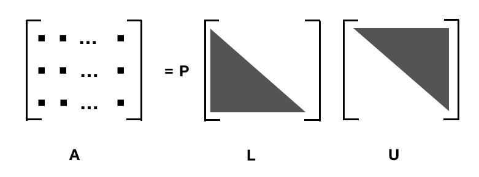
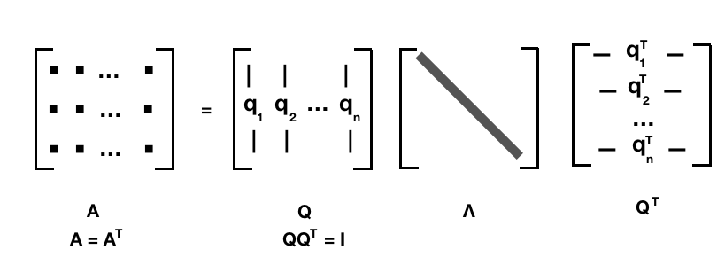

# 矩阵分解 {matirx application}

总结一下之前我们碰到的矩阵的各种分解方式，在开始之前先补充一些定义。

## 定义

### 共轭转置 Conjugate transpose

如果我们有一个复数矩阵A：

$$
{\displaystyle {\boldsymbol {A}}={\begin{bmatrix}1&-2-i&5\\1+i&i&4-2i\end{bmatrix}}}
$$

它的转置$A^T$：

$${\displaystyle {\boldsymbol {A}}^{\mathrm {T} }={\begin{bmatrix}1&1+i\\-2-i&i\\5&4-2i\end{bmatrix}}}$$

共轭转置$\overline{A^T}$:

$${\displaystyle \overline{{\boldsymbol {{A}}}^{\mathrm {T}} }={\begin{bmatrix}1&1-i\\-2+i&-i\\5&4+2i\end{bmatrix}}}$$

共轭转置也经常记为： $A^*, A^H（这个写法跟下面的 Hermitian 定义有关）, \overline{A^T}$

### Hermitian

Hermitian matrix 埃尔米特矩阵： 埃尔米特矩阵中每一个第i行第j列的元素都与第j行第i列的元素的复共轭。 也就是这个矩阵等于它的共轭转置。

复数我们知道 $z = a + ib \in \mathbb{C}$, 共轭我们也清楚 $\bar{z} = a - ib$

$$
{\displaystyle A{\text{ Hermitian}}\quad \iff \quad a_{ij}={\overline {a_{ji}}}} \\
{\displaystyle A{\text{ Hermitian}}\quad \iff \quad A=A^{\mathsf {H}}}
$$

如果 $A \in \mathbb{R}^{n \times n}$ 是实数矩阵，并且是 Hermitian， 那么 $a_{ij} = a_{ji}$， 这就是一个对称矩阵。一般来说，实对称矩阵我们一般就说它是实对称矩阵，不过我们知道，它也是 Hermitian。

如果我们有一个复数矩阵A，那么它需要等于它的共轭转置， 比如：

$$
{\displaystyle A = {\begin{bmatrix}2&2+i&4\\2-i&3&i\\4&-i&1\\\end{bmatrix}}}
$$

其实 Hermitian 也暗示了我们这个矩阵需要是方阵，至少我们转置之后的维度要跟原来的相等嘛。

###  正定 positive definite 

一个 n × n 的实对称矩阵 M 是正定的，当且仅当对于所有的非零实系数向量z，都有 $z^TMz > 0$ 。其中 $z^T$ 表示 z 的转置。

$$
{\displaystyle M{\text{ positive definite}}\quad \iff \quad x^{\textsf {T}}Mx>0{\text{ for all }}x\in \mathbb {R} ^{n}\setminus \mathbf {0} }
$$

首先 实对称矩阵 M 并不一定正定的， 比如 M = -I :

$$
\begin{bmatrix}1 & 0 & 1\end{bmatrix}\begin{bmatrix}-1 & 0 & 0 \\ 0 & -1 & 0 \\ 0 & 0 & -1 \end{bmatrix}\begin{bmatrix}1 \\ 0 \\ 1\end{bmatrix} = -2 < 0
$$

对于复数，一个 n×n 的埃尔米特矩阵 M是正定的当且仅当对于每个非零的复向量z，都有$z^*Mz > 0$。其中z\*表示z的共轭转置。由于 M是埃尔米特矩阵，经计算可知，对于任意的复向量z，$z^*Mz$必然是实数，从而可以与0比较大小。因此这个定义是自洽的。

$${\displaystyle M{\text{ positive definite}}\quad \iff \quad x^{*}Mx>0{\text{ for all }}x\in \mathbb {C} ^{n}\setminus \mathbf {0} }
$$

Hermitian 也当然不一定正定，我们可以有一些判定方法：

- 矩阵M的所有的特征值 $\lambda_i$ 都是正的
- ...

### 正交矩阵 orthogonal matrix

$$Q^{T}=Q^{-1}\Leftrightarrow Q^{T}Q=QQ^{T}=I.\,\!$$

$${\displaystyle 1=det(I)=det(Q^{T}Q)=det(Q^{T})det(Q)=(det(Q))^{2}\Rightarrow det(Q)=\pm 1}$$

- 作为一个线性映射（变换矩阵），正交矩阵保持距离不变，所以它是一个保距映射，具体例子为旋转与镜射。
- 行列式值为+1的正交矩阵，称为特殊正交矩阵(special orthogonal group)，它是一个旋转矩阵。
- 行列式值为-1的正交矩阵，称为瑕旋转矩阵。瑕旋转是旋转加上镜射。镜射也是一种瑕旋转。
- 所有 n × n 的正交矩阵形成一个群 O(n)，称为正交群。亦即，正交矩阵与正交矩阵的乘积也是一个正交矩阵。
- 所有特殊正交矩阵形成一个子群SO(n)，称为特殊正交群。亦即，旋转矩阵与旋转矩阵的乘积也是一个旋转矩阵。

### 酉矩阵 unitary matrix

酉矩阵/幺正矩阵： 

$${\displaystyle U^{*}U=UU^{*}=I_{n}}$$

就是 U 和其 共轭转置 $U^*$ 乘积为 单位矩阵。它是 正交矩阵 在复数上的推广。

> 酉（汉语拼音：yǒu）为地支的第十位，其前为申、其后为戌。酉月为农历八月，酉时为二十四小时制的17:00至19:00，在方向上指正西方。五行里酉代表金，阴阳学说里酉为阴。

说实话，这个字之前还没注意过它怎么念。unitary 作为 unit 的形容词，单位的、一元的，鉴于单位矩阵这个已经被 take 了，被翻成 幺正矩阵 也和不错，也大概有一元那么个意思。翻成酉矩阵大概也是文化人才能做到吧。

酉矩阵有很多很好的性质：

- ${\displaystyle U^{-1}=U^{*}}$, 酉矩阵必定可逆，且逆矩阵等于其共轭转置：
- $|\lambda_n| = 1$, 酉矩阵 U 的所有特征值 $λ_n$ ，其绝对值都是等于 1 的复数：
- ${\displaystyle \left|\det(U)\right|=1}$,   酉矩阵 U 行列式的绝对值也是 1
- ${\displaystyle (U\vec {x} )\cdot (U\vec {y} )=\vec {x} \cdot \vec {y} }$, 酉矩阵 U 不会改变两个复向量 
$\vec{x}$ 和 $\vec{y}$ 的点积
- ...

### 正规矩阵 normal matrix

正规矩阵（英语：normal matrix）A 是与自己的共轭转置满足交换律的复系数方块矩阵，也就是说，A 满足 
$$\mathbf{A}^* \mathbf{A} =  \mathbf{A} \mathbf{A}^*$$

$A^*$ 是 A 的共轭转置。

如果 A是实系数矩阵，则 $A^* = A^T$，从而条件简化为 $AA^T = A^TA$.

正规矩阵的概念十分重要，因为它们正是能使谱定理成立的对象：矩阵 A 正规当且仅当它可以被成 $A = U \Lambda U^*$ 的形式。其中的$\Lambda = diag(\lambda_1, \lambda_2, \dots)$为对角矩阵，U 为酉矩阵。

总而言之，就是 正规矩阵 一定可以 特征分解/频谱分解/谱定理。

### 类比
不同种类的正规矩阵可以与各种复数建立对应的类比关系。比如：

- 可逆矩阵类似于非零的复数。
- 矩阵的共轭转置类似于复数的共轭
- 酉矩阵类似于模等于1的复数。
- 埃尔米特矩阵类似于实数。
- 埃尔米特矩阵中的正定矩阵类似于正实数。

## 分解

### A = PLU

- 适用：方阵
- 分解： A = PLU, L 是 下三角阵， U 是 上三角阵，而 P 则是 permutation 行变换，单位矩阵变换可得， 如果没有行变换，A 就 直接分解成 LU. PLU 分解源自高斯消元法。

所有的方阵都可以写成 PLU 分解的形式。

### Cholesky 分解

- 适用：方阵、hermitian、正定 positive definite 
- 分解： $A = LL^*$

A 是正定的 Hermitian阵， L 是下三角矩阵， $L^*$ 是 L 的共轭转置， 是一个上三角.

### QR分解

- 适用于： 列向量线性无关的矩阵 m x n, m ≥ n
- 分解：A = QR, Q 是 m x m  的 酉矩阵， 又叫做幺正矩阵（unitary matrix）, R 是一个上三角矩阵

对于方阵的 QR 分解我比较熟悉

如果A不是方阵的话，那么三角矩阵只会占据一部分，下面会都是0， 所以经常也这样写 QR 分解：

$${\displaystyle A=QR=Q{\begin{bmatrix}R_{1}\\0\end{bmatrix}}={\begin{bmatrix}Q_{1},Q_{2}\end{bmatrix}}{\begin{bmatrix}R_{1}\\0\end{bmatrix}}=Q_{1}R_{1}}$$

> where R1 is an n×n upper triangular matrix, 0 is an (m − n)×n zero matrix, Q1 is m×n, Q2 is m×(m − n), and Q1 and Q2 both have orthogonal columns.

计算 QR 分解 我们可以用 Gram–Schmidt 或者 Householder reflections.

### 特征分解/频谱分解  Eigendecomposition / spectral decomposition

- 适用于： 具有线性独立特征向量（不一定是不同特征值）的方阵 A
- 分解：$\mathbf{A}=\mathbf{Q}\mathbf{\Lambda}\mathbf{Q}^{-1}$

Q 是 n x n 的矩阵， 第 i 列是 A 的 特征向量 $\vec{q}_i$,  $\Lambda$ 是对角阵，其中第 i个 对角元素$\Lambda_{ii} = \lambda_i$， 是跟 特征向量 $\vec{q}_i$ 对应的 特征值 $\lambda_i$. 这里需要注意只有可对角化矩阵才可以作特征分解。比如${\displaystyle {\begin{bmatrix}1&1\\0&1\\\end{bmatrix}}}$ 不能被对角化，也就不能特征分解。

一般来说，特征向量 $\vec{q}_i, ( i = 1, \cdots, N)$ 一般被单位化（但这不是必须的）。未被单位化的特征向量组 $\vec{q}_i, ( i = 1, \cdots, N)$  也可以作为 Q 的列向量。这一事实可以这样理解： Q 中向量的长度都被 $Q^{-1}$ 抵消了。

这里我们虽然用了 Q 这个字母，但是我们并没有说它是一个正交阵，因为之前写特征分解的时候也提到过：

> 对于任意矩阵，其对应于不同特征值的特征向量线性无关，但不一定正交，而对于实对称矩阵，其对应于不同特征值的特征向量是相互正交的。

特征分解很容易推导：

$$
{\displaystyle {\begin{aligned}\mathbf {A} \mathbf {v} &=\lambda \mathbf {v} \\\mathbf {A} \mathbf {Q} &=\mathbf {Q} \mathbf {\Lambda } \\\mathbf {A} &=\mathbf {Q} \mathbf {\Lambda } \mathbf {Q} ^{-1}.\end{aligned}}}
$$

-  实对称矩阵

对于任意的  n x n 实对称矩阵都有 n 个线性无关的特征向量，并且这些特征向量都可以正交单位化而得到一组正交且模为 1 的向量。所以：

$$\mathbf{A}=\mathbf{Q}\mathbf{\Lambda}\mathbf{Q}^{T}  $$

其中 Q 为正交矩阵，  $\Lambda$ 为对角矩阵。

- 正规矩阵

一个复正规矩阵具有一组正交特征向量基，故正规矩阵可以被分解成
$$\mathbf{A}=\mathbf{U}\mathbf{\Lambda}\mathbf{U}^{*}  $$

其中 U 是 酉矩阵。

> 特征分解对于理解线性常微分方程或线性差分方程组的解很有用。 例如，差分方程 $x_{t+1} = A x_t$ 从初始条件开始  $x_0 = c$ 到 $x_{t}=A^{t}c$ ，相当于 $x_{t}=VD^{t}V^{{-1}}c $，其中V和D是由A的特征向量和特征值形成的矩阵。 由于D是对角线，D 的 t 次幂 $ D^{t}$ 只是涉及将对角线上的每个元素的 t 次幂 。 这与 A 的 t的次幂相比 ，更容易实现和理解，因为A通常不是对角线。

这里就直接点出了一个 特征分解的应用场景。 解 线性常微分方程 或 线性差分方程组。

### 奇异值分解

- 适用于： m x n 矩阵A
- 分解： $A=U \Sigma V^*$, U 和 V 都是 酉矩阵/幺正矩阵， 也就是满足 $U^*U= V^*V = I$,  $\Sigma$ 是对角阵，对角上的元素称为A的奇异值 ,
- U 和 V 并不一定是唯一的。

至此，线性/矩阵相关暂时告一段落。

------------------------

Matlab/numpy 都内置了这些分解方式，而对我们来说，重要的是在合适的场景中选择合适的工具来解决问题。

参考：
大量参考 wikipedia
