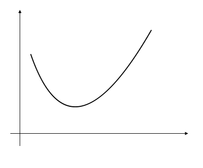
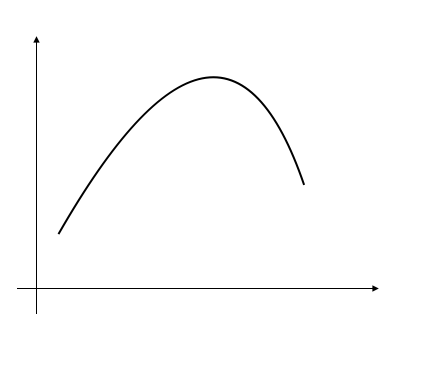
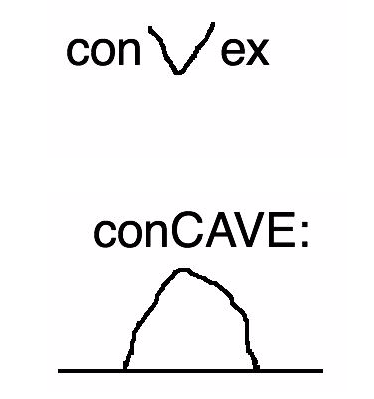
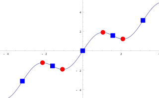
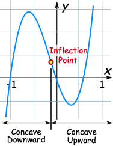
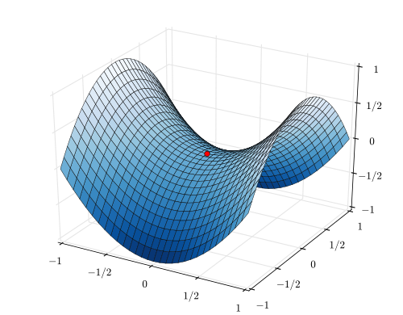
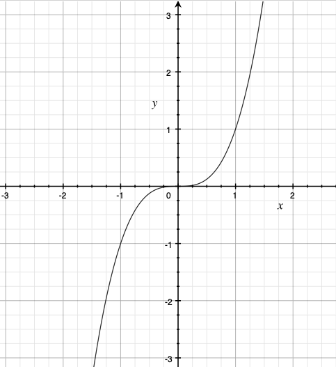

# 临界点、驻点、拐点、鞍点、顶点（曲线） {Points Concepts}

## 临界点 critial point

- $f: \mathbb{R} \to \mathbb{R}$： 不可微或者导数为0的点
- $f: \mathbb {C} \to \mathbb{C}$: 不是全纯（？）或者导数等于0
- $f: \mathbb {R}^n \to \mathbb{R}$: 梯度没有定义或者等于0
- $f: \mathbb {R}^m \to \mathbb{R}^n$: Jacobian的秩 不是最大的

临界点是我们用来求极值可能出现的点。

## 驻点 stationary point

驻点(stationary point) 是指的 $f: \mathbb{R} \to \mathbb{R}$ 情况下的临界点，看驻点的定义：

$$
 \left.\frac{dy}{dx}\right|_p=0 \,
$$

之所以翻译成 驻点(stationary point)  我想应该是正因为这一点导数为0， 微小的 x 变化并不带来 y 的变化，所以叫 stationary point，翻译成驻点也合理。 

## 拐点 inflection point

inflect 本身就有弯曲、改变的意思。

最近大家都在讲的‘拐点’，英文也可以是 inflection、 flex。

> 拐点（Inflection point）或称反曲点，是一条连续曲线改变凹凸性的点，或者等价地说，是使切线穿越曲线的点。

说起来这个 convex 和 concave  也是有一点令人窒息的：

### convex 凸函数

$${\displaystyle f((1-\alpha )x+\alpha y)\leq (1-\alpha )f(x)+\alpha f(y)}$$

### concave 凹函数：

$${\displaystyle f((1-\alpha )x+\alpha y)\geq (1-\alpha )f(x)+\alpha f(y)}$$

我要窒息了，我还是学别人来这样记吧，  convex v , concave/cave 洞穴

或者我来记 convex下凸， concave上凸

红色的点是 驻点/临界点 stationary points/critial points, 蓝色的点是 拐点 inflection points.

inflection point ：

拐点并不是不连续，毕竟满足了曲线的定义都 $C^0$ 连续， 上面这个曲线是 正弦曲线，是一个$C^\infty$ 连续的。它只是一种 convex/concave 的变化。

## 鞍点 saddle point

> 一个不是局部极值点的驻点称为鞍点。

鞍点的英文是 saddle point 或者 minmax point.

鞍点来自于双曲面，比如下图 $f(x,y) = x^2 - y^2$, 在(0, 0) 是一个临界点，但它并不是极值点，长得像马鞍的形状，所以叫鞍点。

> 在一维空间里，鞍点是驻点·也是拐点。因为函数图形在鞍点由凸转凹，或由凹转凸。

比如 $y = x^3 $ 在 (0, 0） 处即是驻点也是拐点。

## 顶点（曲线）vertex (curve)

强调这个顶点是属于曲线的

> 在平面曲线中， 顶点是曲率的一阶导数为零的点。 这通常是曲率的局部最大值或最小值，并且一些人将顶点定义为更具体地是曲率的局部极限点。 

考虑抛物线 $y = ax^2 + bx + c$

它的有符号的曲率是：

$${\displaystyle k(x)={\frac {2a}{\left(1+(2ax+b)^{2}\right)^{\frac {3}{2}}}}.}$$

它的曲率极值点在 $x = -b/2a$ 处取到，这个点是它的驻点（导数也为0），同时这个点也是它的顶点。

