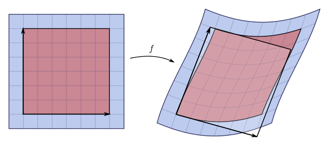

# 导数、梯度、 Jacobian、Hessian {Gradient Related Concepts}

之前写过关于[梯度](https://zhuanlan.zhihu.com/p/97545154)的文章，是从线性近似着手开始写起，这里我再次回顾梯度和一些相关的矩阵:

- 一元函数： $f: \mathbb{R} \to \mathbb{R}$
- 多元函数： $f: \mathbb{R}^n \to \mathbb{R}$
- 向量函数： $f: \mathbb{R}^n \to \mathbb{R}^m$

以下讨论都预先预设假设 f 必定可导甚至更高阶可导。

## 导数

针对一元函数 $f: \mathbb{R} \to \mathbb{R}$， 近似：

$$f(x) \approx f(x_0) + f'(x_0)(x-x_0)$$

## 梯度

梯度针对多元函数 $f: \mathbb{R}^n \to \mathbb{R}$ ，是导数的推广， 它的结果是一个向量：

$$
\nabla f = \begin{pmatrix} \frac{\partial f}{\partial x_1} \\ \frac{\partial f}{\partial x_2} \\ \vdots \\ \frac{\partial f}{\partial x_n}  \end{pmatrix}
$$

也经常写为， 函数相对于 n x 1 向量 $\vec{x}$  的梯度算子为 $\nabla_{\boldsymbol{x}}$:

$$
\nabla_{\boldsymbol{x}} \overset{\underset{\mathrm{def}}{}}{=} \left[ \frac{\partial }{\partial x_1}, \frac{\partial }{\partial x_2},\cdots,\frac{\partial }{\partial x_n} \right]^T=\frac{\partial }{\partial \boldsymbol{x}}
$$

近似： 

$$f(\vec{x}) \approx f(\vec{x}_0) + \nabla f(\vec{x}_0) \cdot (\vec{x} - \vec{x}_0)$$

## Jacobian 雅可比矩阵

我喜欢 Jacobian 的英文读音，听起来很可爱。

针对向量函数 $f: \mathbb{R}^n \to \mathbb{R}^m$

> 如果函数  $f: \mathbb{R}^n \to \mathbb{R}^m$ 在点 x 可微的话，在点 x  的雅可比矩阵即为该函数在该点的最佳线性逼近，也代表雅可比矩阵是单变数实数函数的微分在向量值多变数函数的推广，在这种情况下，雅可比矩阵也被称作函数 f 在点 x 的微分或者导数。

$$
{\displaystyle \mathbf {J} ={\begin{bmatrix}{\dfrac {\partial \mathbf {f} }{\partial x_{1}}}&\cdots &{\dfrac {\partial \mathbf {f} }{\partial x_{n}}}\end{bmatrix}}={\begin{bmatrix}{\dfrac {\partial f_{1}}{\partial x_{1}}}&\cdots &{\dfrac {\partial f_{1}}{\partial x_{n}}}\\\vdots &\ddots &\vdots \\{\dfrac {\partial f_{m}}{\partial x_{1}}}&\cdots &{\dfrac {\partial f_{m}}{\partial x_{n}}}\end{bmatrix}}}
$$

矩阵分量：

$$
{\displaystyle \mathbf {J} _{ij}={\frac {\partial f_{i}}{\partial x_{j}}}.}
$$

其它常用符号：

${\displaystyle Df}、 {\displaystyle \mathrm {D} \mathbf {f} }、{\displaystyle \mathbf {J} _{\mathbf {f} }(x_{1},\ldots ,x_{n})}$ 或者 ${\displaystyle {\frac {\partial (f_{1},\ldots ,f_{m})}{\partial (x_{1},\ldots ,x_{n})}}.}$

近似：

$$
f(\vec{x}) \approx f(\vec{x}_k) + J(\vec{x}_k)(\vec{x} - \vec{x}_k)
$$

如果 m = n，那么 Jacobian 可以形成方阵，这个矩阵可以计算出它的行列式：

叫做 Jacobian Matrix，它的意义是比如这个微小形状改变的比值。

## Hessian 黑塞矩阵

适用于  $f: \mathbb{R}^n \to \mathbb{R}$ 有点二阶导数的意思：

$$
{\displaystyle \mathbf {H} ={\begin{bmatrix}{\frac {\partial ^{2}f}{\partial x_{1}^{2}}}&{\frac {\partial ^{2}f}{\partial x_{1}\,\partial x_{2}}}&\cdots &{\frac {\partial ^{2}f}{\partial x_{1}\,\partial x_{n}}}\\\\{\frac {\partial ^{2}f}{\partial x_{2}\,\partial x_{1}}}&{\frac {\partial ^{2}f}{\partial x_{2}^{2}}}&\cdots &{\frac {\partial ^{2}f}{\partial x_{2}\,\partial x_{n}}}\\\\\vdots &\vdots &\ddots &\vdots \\\\{\frac {\partial ^{2}f}{\partial x_{n}\,\partial x_{1}}}&{\frac {\partial ^{2}f}{\partial x_{n}\,\partial x_{2}}}&\cdots &{\frac {\partial ^{2}f}{\partial x_{n}^{2}}}\end{bmatrix}}\,}
$$

是一个 n x n 的方阵，也可以写成：

$$
{\displaystyle \mathbf {H} _{ij}={\frac {\partial ^{2}f}{\partial x_{i}\partial x_{j}}}}
$$

之所以说它二次导数，看一下它的推导 ：

- $f: \mathbb{R} \to \mathbb{R}$

$$
f(x) \approx f(x_0) + f'(x_0 )(x − x_0 ) + \frac{1}{2}f''(x_0 )(x − x_0 )^2
$$

-  $f: \mathbb{R}^n \to \mathbb{R}$:

$$
f(x_1,x_2)=f(x_{10},x_{20})+f_{x_1}(x_{10},x_{20})\Delta x_1+f_{x_2}(x_{10},x_{20})\Delta x_2+\frac {1}{2}[f_{x_1 x_1}(x_{10},x_{20})\Delta x_1^2+2f_{x_1 x_2}(x_{10},x_{20})\Delta x_1\Delta x_2+f_{x_2 x_2}(x_{10},x_{20})\Delta x_2^2]
$$

其中 ${\displaystyle \Delta x_{1}=x_{1}-x_{10}\,}，{\displaystyle \Delta x_{2}=x_{2}-x_{20}\,}，{\displaystyle f_{x_{1}}={\frac {\partial f}{\partial x_{1}}}\,}，{\displaystyle f_{x_{2}}={\frac {\partial f}{\partial x_{2}}}\,}，{\displaystyle f_{x_{1}x_{1}}={\frac {\partial ^{2}f}{\partial x_{1}^{2}}}\,}，{\displaystyle f_{x_{2}x_{2}}={\frac {\partial ^{2}f}{\partial x_{2}^{2}}}\,}，{\displaystyle f_{x_{1}x_{2}}={\frac {\partial ^{2}f}{\partial x_{1}\partial x_{2}}}={\frac {\partial ^{2}f}{\partial x_{2}\partial x_{1}}}\,}$

写成向量形式：

$$f(\vec{x}) \approx f(\vec{x_0}) +   \nabla f(\vec{x_0}) \cdot (\vec{x} - \vec{x_0}) + \frac{1}{2}(\vec{x} - \vec{x_0})^TH(\vec{x_0})(\vec{x} - \vec{x_0})$$

其中

$$
{\displaystyle H(x_{0})={\begin{bmatrix}{\frac {\partial ^{2}f}{\partial x_{1}^{2}}}&{\frac {\partial ^{2}f}{\partial x_{1}\,\partial x_{2}}}\\\\{\frac {\partial ^{2}f}{\partial x_{2}\,\partial x_{1}}}&{\frac {\partial ^{2}f}{\partial x_{2}^{2}}}\end{bmatrix}}_{x_{0}}\,}
$$

所以推广到更高阶就如上所示，那么Hessian 的一个很具体的应用就是，判断函数的极值，正如导数的作用一样。

一元函数： $f: \mathbb{R} \to \mathbb{R}$ ,在 $ x=x_0$ 点处具有二阶导数，且 $f'(x_{0})=0, f''(x_{0}) \neq 0$, 则

- $f''(x) < 0$, 极大值
- $f''(x) > 0$, 极小值
- $f''(x) = 0$, 鞍点
- $f''(x)$ 不存在，没法直接判断，或许是极值点

那么针对于 $f: \mathbb{R}^n \to \mathbb{R}$， 在 $\vec{x}_0$ 处梯度为 $\vec{0}$，那么我们可以用 $H(\vec{x_0})$ 来帮助判断：

- H 正定, 极小值
- H 负定, 极大值
- H 不定， 鞍点
- H 不可逆， 也不能直接判断

至于判定矩阵是否正定可以：

- 尝试Cholesky分解，看其是否存在
- 计算所有的特征值，看是否为正

