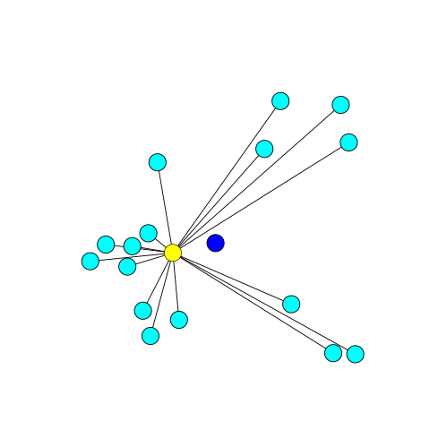

# 无约束优化 {Optimization without constraintss}

## 例子

之前我们讨论了许多优化问题：

问题  | 目标函数 | 约束
------------- | -------------| -------------
最小二乘法   | $E(\vec{x}) = \parallel A\vec{x} - \vec{b} \parallel^2$| 无
把$\vec{b}$ 投影到 $\vec{a}$ 上  | $E(c) = \parallel c\vec{a} - \vec{b} \parallel^2$| 无
实对称矩阵的特征向量  | $E(\vec{x}) = \vec{x}^TA\vec{x}$ | $\parallel \vec{x} \parallel = 1$
Pseudoinverse | $E(\vec{x}) = \parallel \vec{x} \parallel^2$ | $A^TA\vec{x} = A^T\vec{b}$
主成分分析 | $E(C) = \parallel X - CC^TX \parallel_{Fro}$ | $C^TC = I_{d \times d}$
Broyden step | $E(J_k) = \parallel J_k - J_{k-1} \parallel_{Fro}^2$| $J_k \cdot (\vec{x}_k - \vec{x}_{k-1}) = f(\vec{x}_k) - f(\vec{x}_{k-1})$

有些是有约束的，有些没有，我们现在先考虑无约束的问题，set up 如下：

$$
min_{\vec{x}} f(\vec{x})
$$

- 例子一

可以有很多例子，比如数据拟合，类似最小二乘法，不过现在我们是想用一个指数来拟合：

$$
E(a, c) = \sum_i (y_i - c e^{ax_i})^2
$$

- 例子二

给一堆数据，怀疑正态分布，用正态分布来拟合：

$$
g(h; \mu, \sigma)={\frac {1}{\sigma {\sqrt {2\pi }}}}e^{-(h - \mu)^2/2 \sigma^2}
$$

给一大堆独立数据 ${h_1, \cdots, h_n}$ ：

$$
P({h_1, \cdots, h_n}; \mu, \sigma) = \prod_i g(h_i, \mu, \sigma)
$$

要求估算出 $\mu, \sigma$ 来最大化概率分布， 感觉 贝叶斯/NLP 中间会有很多这种模型的应用。

- 例子三

给一堆数据，我们想找到它的几何中心（geometric median），注意这个不同于质心，比如下图：

蓝色的店是质心，黄色的点是几何中心，几何中心满足：

$$
E(\vec{x}) = \sum_i \parallel \vec{x} - \vec{x}_i \parallel_2
$$

注意这里只是 l2 norm, 并没有平方。

## 极值

全局最小值：

$$
\vec{x}^* \in  \mathbb{R}^n \\
f: \mathbb{R}^n \to \mathbb{R} \\
\forall \vec{x} \in \mathbb{R}^n f(\vec{x})^* \le f(\vec{x}) 
$$

局部最小值：

$$
\vec{x}^* \in  \mathbb{R}^n \\
f: \mathbb{R}^n \to \mathbb{R} \\
\forall \parallel \vec{x} - \vec{x}^* \parallel < \varepsilon,   f(\vec{x})^* \le f(\vec{x}) 
$$

最大值的定义也是类似的，无约束优化其实就是一个求极值的问题。求极值这个问题我们在数学上还是比较熟悉的。同样，我们从一元函数开始。

## 一元函数

### 牛顿法 

$f: \mathbb{R} \to \mathbb{R}$， 如果函数可微，那么极值的可能出现点就包括了 驻点、边界以及导数不存在的点，此处我们集中讨论驻点的情况。也就是导数 $f'(x) = 0$ 的点 。 鉴于之前我们已经讨论过一元函数求根 $f(x) = 0$。 这里无非也就是变成了求解 $f'(x) = 0$， 那么依旧可以使用 牛顿法：

$$
{\displaystyle x_{k+1} = x_{k}-{\frac {f'(x_{k})}{f''(x_{k})}}.}
$$

### 黄金分割搜索 Golden-section search

适用条件： 单峰函数 Unimodal function， 顾名思义 单峰 unimodular 就是指的有一个峰值。

单峰：

双峰：

单峰定义：
$f: [a, b] \to \mathbb{R}$ 存在  $x^* \in [a, b]$ 满足 f 在 $x \in [a, x^*]$ 是递减， 在 $x \in [x^*, b]$ 递增。

我们可以利用单峰的性质来用之前类似二分的思路求解。

假设 $a < x_0 < x_1 < b$, 假设我们有：

- $f(x_0) \le f(x_1)$ , 那么对于  $x \in [x_1, b]$, 都有 $f(x) \ge f(x_0)$, 最小值点 $x^* \in [a, x_1]$, 所以可以丢掉区间 $[x_1, b]$
- $f(x_0) \ge f(x_1)$ , 那么对于  $x \in [a, x_0]$, 都有 $f(x) \ge f(x_1)$, 最小值点 $x^* \in [x_0, b]$, 所以可以丢掉区间 $[a, x_0]$

但是这样每一轮需要计算 $f(x_0)， f(x_1)$, 懒的本性想让我们重复利用之前的计算结果，所以我们这样来考虑，假设 a = 0, b = 1, 第一轮我们计算：

$$x_0 = \alpha, x_1 = 1 - \alpha, \alpha \in (0, \frac{1}{2})$$

- 假设是上面的 $f(x_0) \le f(x_1)$ 的情况的话，区间变成：

$$[a, x_1] = [0, 1- \alpha]$$

第二轮我们的选择点是：

$$\alpha(1- \alpha), (1 - \alpha)^2$$

如果 

$$x_0 = \alpha = (1 - \alpha)^2 $$

那么 我们就可以减少一次计算：

$$\alpha^2 - 3 \alpha + 1 = 0 \\
\alpha = \frac{1}{2}(3 - \sqrt{5}) \\
1 - \alpha = \frac{1}{2}(\sqrt{5} - 1) $$

$1 - \alpha = \tau$ 满足黄金分割比例。
   
- 假设是上面的 $f(x_0) \ge f(x_1)$ 的状况， 区间变成：

$$
[x_0, 1] = [\alpha, 1]
$$

第二轮选择点是：
    
$$\alpha + \alpha(1- \alpha), \alpha + (1 - \alpha)^2$$

如果：
    
    
$$x_0 = 1 - \alpha = \alpha + \alpha(1 - \alpha) $$

得到相同的方程式，相同的解，所以我们可以有 黄金分割搜索：

1. 初始化 a, b 使得 f 在 [a, b] 上是 unimodular
2. $x_0 = a + (1-\tau)(b-a), x_1 = a + \tau(b-a), f_0 = f(x_0), f_1 = f(x_1)$
3. 迭代直到 b - a 足够小：
    - $f_0 \ge f_1$, 丢掉 $[a, x_0]$
        - $a \gets x_0$
        - $x_0 \gets x_1, f_0 \gets f_1$
        - $x_1 \gets  a + \tau(b-a), f_1 \gets f(x_1)$
    - $f_1 > f_0$, 丢掉 $[x_1, b]$
        - $b \gets x_1$
        - $x_1 \gets x_0, f_1 \gets f_0$
        - $x_0 \gets a + (1-\tau)(b-a), f_0 \gets f(x_0)$
    

## 多元函数

$f: \mathbb{R}^n \to \mathbb{R}$, 针对多元函数，感觉最出名就是梯度下降了（类比下山）。

### 梯度下降法

> 梯度下降方法基于以下的观察：如果实值函数 $F(\vec{x})$ 在点 $\vec {a}$ 处可微且有定义，那么函数 $F(\vec{x})$  在 $\vec{a}$  点沿着梯度相反的方向 $-\nabla F({\vec  {a}})$ 下降最多。

> 因而，如果 ${\vec  {b}}={\vec  {a}}-\gamma \nabla F({\vec  {a}})$ 对于 $ \gamma >0$ 为一个够小数值时成立，那么 $F({\vec  {a}})\geq F({\vec  {b}})$。

所以我们可以有梯度下降法的明确步骤：

- 随机预估的 $x_0$ 
- $g_k(t) = f(\vec{x}_k - t \nabla f(\vec{x}_k))$
- 搜索找到 $t^* \ge 0$ 同时最小化 $g_k$
- $\vec{x}_{k+1} = \vec{x}_k - t^* \nabla f(\vec{x}_k)$

### 牛顿法

同样类似一元函数，我们可以推广牛顿法：

$$\vec{x}_{k+1} = \vec{x}_k - [H_f(\vec{x}_k)]^{-1} \nabla f(\vec{x}_k)$$

使用牛顿法的问题在于  $\nabla f(\vec{x})$ 已经比较难计算了，而再加上 Hessian 矩阵，痛苦+n， 所以我们依旧寻求之前的 单变量 拟牛顿法 Quasi-Newton method 来前进。

### BFGS

想不到 BFGS 的全称是 Broyden–Fletcher–Goldfarb–Shanno algorithm，此 Shanno 非彼 Shanno，是四位研究优化的数学家的名字，这个算法类似之前出现过的 Broyden's method， 我们用矩阵来近似Hessian 矩阵 :

$$
\vec{x}_{k+1} = \vec{x}_k - \alpha_k B_{k}^{-1}\nabla f(\vec{x}_k) \\
B_k \approx H_f(\vec{x}_k)
$$

$$
B_{k+1} ( \vec{x}_{k+1} - \vec{x}_k)  =  \nabla f(\vec{x}_{k+1}) - \nabla f(\vec{x}_{k}) 
$$

B 有一些很好的性质：

- 对称
- 半正定

所以我们需要做的优化就是：

$$
min_{B_{k+1}} \parallel B_{k+1} - B_k \parallel \\
s.t. B_{k+1}^T = B_{k+1} \\
B_{k+1} ( \vec{x}_{k+1} - \vec{x}_k)  =  \nabla f(\vec{x}_{k+1}) - \nabla f(\vec{x}_{k}) 
$$

而 $\parallel B_{k+1} - B_k \parallel  $ 最小化 并不能保证 $\parallel B_{k+1}^{-1} - B_k^{-1} \parallel $ 很小，所以我们应当要求解的是：

$$
min_{H_{k+1}} \parallel H_{k+1} - H_k \parallel \\
s.t. H_{k+1}^T = H_{k+1} \\
\vec{x}_{k+1} - \vec{x}_k  =  H_{k+1} ( \nabla f(\vec{x}_{k+1}) - \nabla f(\vec{x}_{k}) ) 
$$

更多关于此算法参考：

[Broyden–Fletcher–Goldfarb–Shanno algorithm](https://en.wikipedia.org/wiki/Broyden–Fletcher–Goldfarb–Shanno_algorithm)
