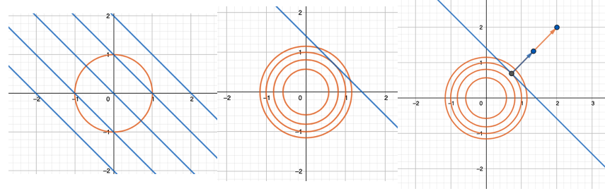
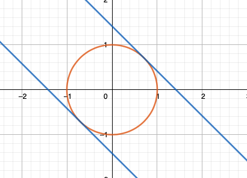
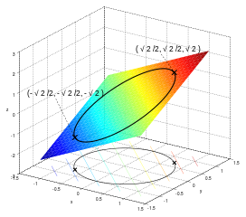
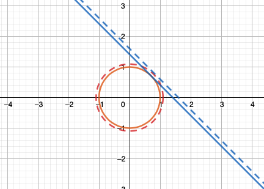
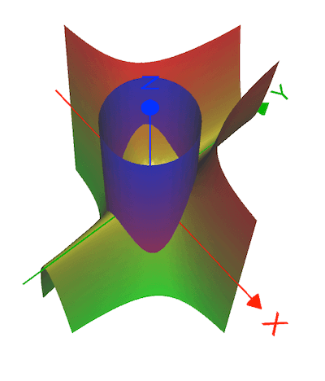
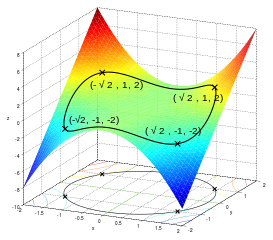
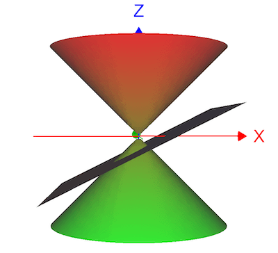
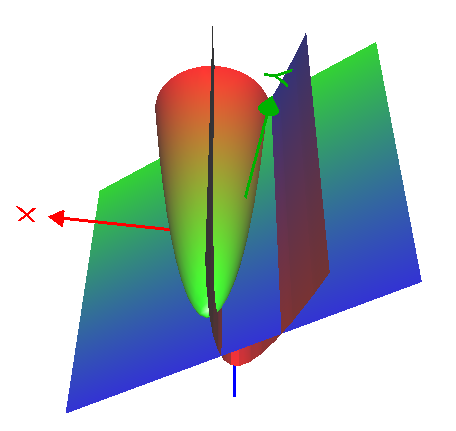

# 从拉格朗日乘子法到KKT条件 {Lagrange multiplier to KKT condition}

关于 拉格朗日乘子法 最容易的理解是从 水平集/等高线（level set/contour）开始。

经常会看到它的各种各样写法，比如：

$$
\text{min/max }f(x,y) \\
\text{subject to } g(x,y) = c\\
$$

$$
\mathcal {L}(x,y,\lambda )=f(x,y) - \lambda \cdot ( g(x,y) - c )\\
\mathcal {L}(x,y,\lambda )=f(x,y) + \lambda \cdot ( g(x,y) - c )\\
$$

或者：

$$
\text{min/max } f(x,y) \\
\text{subject to } g(x,y) = 0 \\
$$

$$
\mathcal {L}(x,y,\lambda )=f(x,y) - \lambda \cdot g(x,y) \\
\mathcal {L}(x,y,\lambda )=f(x,y) + \lambda \cdot g(x,y)\\
$$

在 $g(\mathbf{x}) = \mathbf{0}$ 约束下本质都一样。

## 介绍

- 例子一

$$
f(x,y) = x + y \\
\text{s.t. }  x^2 + y^2 = 1 \\
$$

比如以上给定的 f(x,y)  和 约束g(x,y), 极值的可能出现点是在 f(x,y) 和 g(x,y) 等高线相切的地方，那么也就是梯度方向相同的地方:

也就是上图最右，也就是：

$$
\nabla f = \lambda \nabla g
$$

而 拉格朗日乘数法 聪明的地方在于把 上述所有条件 pack在一个里面:

$${\displaystyle {\begin{aligned}{\mathcal {L}}(x,y,\lambda )&=f(x,y) - \lambda \cdot g(x,y)\\[4pt]&=x+y - \lambda (x^{2}+y^{2}-1).\end{aligned}}}$$

求解：

$$
\frac{\partial \mathcal{L}}{\partial x} = 1 - 2 \lambda x = 0 \\
\frac{\partial \mathcal{L}}{\partial x} = 1 - 2 \lambda y = 0 \\
\frac{\partial \mathcal{L}}{\partial \lambda} = x^2 + y^2 - 1 = 0
$$

解出： $\lambda = \pm\frac{1}{\sqrt{2}}$

最值点：

$$
f(\frac{1}{\sqrt{2}}, \frac{1}{\sqrt{2}}) = \sqrt{2}\\
f(-\frac{1}{\sqrt{2}}, -\frac{1}{\sqrt{2}}) = -\sqrt{2}\\
$$

这个 $\lambda$ 也是有物理意义的，比如 在 $\lambda = \frac{1}{\sqrt{2}}$ 这里，它的物理意义是 假设 约束 有微小变化，此时 函数 f(x,y) 的变化.

- 例子二

$$
f(x,y) = x^2 y \\
\text{s.t. }  x^2 + y^2 = 3  \\
$$

$${\displaystyle {\begin{aligned}{\mathcal {L}}(x,y,\lambda )&=f(x,y) - \lambda \cdot g(x,y)\\[4pt]&=x^2y - \lambda (x^{2}+y^{2}-3).\end{aligned}}}$$

求解：

$$
\frac{\partial \mathcal{L}}{\partial x} = 2xy - 2 \lambda x = 0 \\
\frac{\partial \mathcal{L}}{\partial x} = x^2 - 2 \lambda y = 0 \\
\frac{\partial \mathcal{L}}{\partial \lambda} = x^2 + y^2 - 3 = 0
$$

解出实际上有6个关键点，最终满足条件的最大最小值如下：

- 例子三

假设我们有离散概率分布 $\{p_{1},p_{2},\ldots ,p_{n}\}$, 想要具有最大的 信息熵:

$$
f(p_{1},p_{2},\ldots ,p_{n})=-\sum _{j=1}^{n}p_{j}\log _{2}p_{j} \\
\text{s.t. } g(p_{1},p_{2},\ldots ,p_{n})=\sum _{j=1}^{n}p_{j}=1
$$

同样构造

$${\displaystyle {\begin{aligned}{\mathcal {L}}(x,y,\lambda )&=f(x,y) - \lambda \cdot g(x,y)\\[4pt]&= -\sum _{j=1}^{n}p_{j}\log _{2}p_{j} - \lambda (\sum _{j=1}^{n}p_{j} - 1)\end{aligned}}}$$

对每一个 $p_k$ 求导：

$$
-\left({\frac {1}{\ln 2}}+\log _{2}p_{k}^{*}\right) - \lambda =0.
$$

最终可知：

$$
p_{k}^{*}={\frac {1}{n}}.
$$

均匀分布具有最大信息熵

## 多个约束

如果我们有多个约束，比如：

$$
f(x,y) \\
\text{s.t. } g_i(x) = 0, i = 1, \cdots , M
$$

那么我们的做法也是类似的，

$$
{\displaystyle {\mathcal {L}}\left(x_{1},\ldots ,x_{n},\lambda _{1},\ldots ,\lambda _{M}\right)=f\left(x_{1},\ldots ,x_{n}\right)-\sum \limits _{k=1}^{M}{\lambda _{k}g_{k}\left(x_{1},\ldots ,x_{n}\right)}} 
$$

$$
{\displaystyle \nabla _{x_{1},\ldots ,x_{n},\lambda _{1},\ldots ,\lambda _{M}}{\mathcal {L}}(x_{1},\ldots ,x_{n},\lambda _{1},\ldots ,\lambda _{M})=0\iff {\begin{cases}\nabla f(\mathbf {x} )-\sum _{k=1}^{M}{\lambda _{k}\,\nabla g_{k}(\mathbf {x} )}=0\\g_{1}(\mathbf {x} )=\cdots =g_{M}(\mathbf {x} )=0\end{cases}}}
$$

### 例子

给定约束： $z^2 = x^2 + y^2  ， x - 2z = 3$， 求满足约束的到原点的距离的极值, 约束条件如图：

距离虽然是 $d = \sqrt{x^2 + y^2 + z^2}$, 这里我们偷个懒，就用 $f(x,y,z) = d^2$

$$
f(x,y, z) = x^2 + y^2 + z^2 \\
x^2 + y^2 = z^2 \\
x - 2z = 3 \\
$$

计算：

$${\displaystyle {\begin{aligned}{\mathcal {L}}(x,y,z,\lambda, \mu )&=f(x,y,z) - \lambda \cdot g(x,y,z) - \mu \cdot h(x,y,z) \\[4pt]&= x^2 + y^2 + z^2  - \lambda (x^2 + y^2 - z^2 ) - \mu(x - 2z -3) \end{aligned}}}$$

求解：

$$
\frac{\partial \mathcal{L}}{\partial x} = 2x -  2\lambda x - \mu = 0 \\
\frac{\partial \mathcal{L}}{\partial y} = 2y -  2\lambda y = 0 \\
\frac{\partial \mathcal{L}}{\partial y} = 2z +  2 \lambda z + 2\mu= 0 \\
\frac{\partial \mathcal{L}}{\partial \lambda} = x^2 + y^2 - z^2 = 0 \\
\frac{\partial \mathcal{L}}{\partial \mu} =  x - 2z -3  = 0
$$

最终按照以上条件可以解出:

$$
(-3, 0, 3) \to d_{max} = 3\sqrt{2} \\
(1, 0, -1) \to d_{min} = \sqrt{2}
$$

## KKT 条件

### 介绍

KKT 条件（Karush–Kuhn–Tucker conditions） 则是更近一步，我们先考虑问题：

$$
f(x,y) \\
\text{s.t } g(\mathbf{x}) \le 0
$$

这个约束我们称之为 primal feasibility , 根据这个我们来定义 可行域 feasible region：

$$
K = \{ \mathbf{x} \in \mathbb{R}^n | g(\mathbf{x}) \le  0\}
$$

那么最优点 会有两种情况：

- $g(\mathbf{x}) =  0$, 在边界，边界解(boundary solution)，此时约束是有效的(active)
- $g(\mathbf{x}) < 0$, 在内部，内部解(interior solution)，此时约束是无效的(inactive)

写出拉格朗日乘子：

$$\mathcal {L}(\mathbf{x},\lambda )=f(\mathbf{x}) + \lambda \cdot g(\mathbf{x})\\$$

然后分情况讨论：

- 内部解，我们可以认为约束无效，所以可以认为条件是：

$$
\nabla f = \mathbf{0} \\
\lambda  = 0
$$

- 边界解：

那就跟拉格朗日乘子法一样了，需要满足：

$$
g(\mathbf{x}) = 0 \\
\nabla f = -\lambda \nabla g
$$

这里的正负号是有意义的，我们希望最小化f， 而 $\nabla f$ 指向的是 f 在 $\mathbf{x}$ 的最陡上升方向，应该指向 可行域 的内部， 不过 $\nabla g$ 指向 K 的外部，即 $g(\mathbf{x}) > 0$ 的区域：

所以

$$
\lambda \ge 0 
$$

上面这个 $\lambda \ge 0$ 条件称为  dual feasibility.

无论是边界解还是内部解，下面式子是一定满足的：

$$
\lambda g(\mathbf{x}) = 0
$$

这个条件 $\lambda g(\mathbf{x}) = 0$ 称为 complementary slackness.

## KKT 条件

我们可以总结上面的结论 再加上 等式约束：

Optimize 

$$
f(\mathbf {x} )
$$

subject to

$$
{\displaystyle g_{i}(\mathbf {x} )\leq 0,}\\
{\displaystyle h_{i}(\mathbf {x} )=0.}
$$

${\displaystyle g_{i}\ (i=1,\ldots ,m)}$ 为不等式约束， ${\displaystyle h_{i}\ (i=1,\ldots ,\ell )}$ 为等式约束。

- Stationarity

For maximizing  ${\displaystyle \nabla f(x^{*})-\sum _{i=1}^{m}\mu _{i}\nabla g_{i}(x^{*})-\sum _{j=1}^{\ell }\lambda _{j}\nabla h_{j}(x^{*})=0,}$

For minimizing : ${\displaystyle \nabla f(x^{*})+\sum _{i=1}^{m}\mu _{i}\nabla g_{i}(x^{*})+\sum _{j=1}^{\ell }\lambda _{j}\nabla h_{j}(x^{*})=0,}$

- Primal feasibility

$$
{\displaystyle g_{i}(x^{*})\leq 0,{\text{ for }}i=1,\ldots ,m}\\
{\displaystyle h_{j}(x^{*})=0,{\text{ for }}j=1,\ldots ,\ell \,\!}
$$

- Dual feasibility 

${\displaystyle \mu _{i}\geq 0,{\text{ for }}i=1,\ldots ,m}$

- Complementary slackness

${\displaystyle \mu _{i}g_{i}(x^{*})=0,{\text{ for }}\;i=1,\ldots ,m.}$

## 例子

$$
\text{minimize } x_1^2 + x_2^2 - 4x_1 - 4x_2 \\
\text{s.t } x_1^2 \le x_2 \\
x_1 + x_2 \le 2
$$

重写成：

$$
L(x_1, x_2, \mu_1, \mu_2) =  x_1^2 + x_2^2 - 4x_1 - 4x_2 + \mu_1(x_1^2 - x_2) + \mu_2( x_1 + x_2 - 2) \\
x_1^2 - x_ 2 \le 0 \\
x_1 + x_2 - 2 \le 0 \\
\mu_1 \ge 0 \\
\mu_2 \ge 0
$$

进一步：

$$
2x_1 + 2\mu_1x_1 + \mu_2 -4 = 0 \\
2x_2 - \mu_1 + \mu_2 - 4 = 0 \\
\mu_1(x_1^2 - x_2) = 0\\
\mu_2(x_1+x_2-2) = 0 \\
\mu_1, \mu_2 \ge 0
$$

尝试求解：

-  $\mu_1 = 0, x_1 + x_2 -2 = 0 \to x_2 = 1, x_1 = 1,\mu_2 = 2$ 
- $\mu_2 = 0, x_1^2 = x_2 \to x_1 = -2, x_2 = 4, \mu_1 = 4 $
- $\mu_1 = \mu_2 = 0 \to x_1 = 2, x_2 = 2, x_2 = x_1^2$ 不可能   
- $x_1^2 - x_2 = 0, x_1 + x_2 -2 = 0 \to x_1 = 1, x_1 = -2 \cdots$ 已经在以上情况中

最终最小值是在 f(1, 1) = -6

偏个题， 其实这里这个 $f(x_1, x_2) = x_1^2 + x_2^2 - 4x_1 - 4x_2 = (x_1 -2)^ 2 + (x_2 - 2)^2 - 8$，如果把 $x_1, x_2$ 用 x，y 来代替画图的话如下：

如果没有限制的话最小值是在 (2,2) 处取得，在有限制的情况下， (1, 1) 更靠近 (2,2), 所以也是合理的解。

