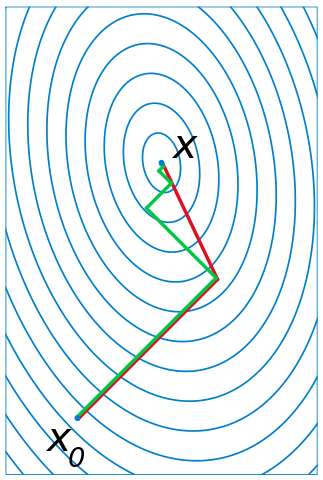
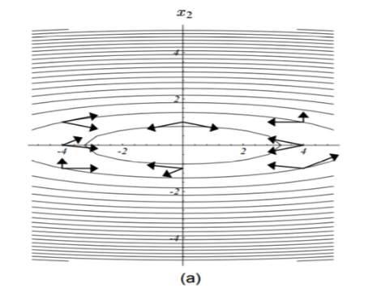
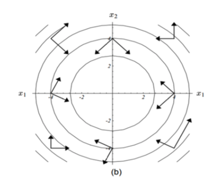

# 从梯度下降到共轭梯度 {Conjugate gradient}

线性方程组 $Ax =b$ 除了高斯消元法以外，还有一些很有趣的迭代解法, 比如雅可比法（Jacobi Method），高斯－赛德尔迭代（Gauss–Seidel method）。

这里只针对 A 满足 对称 ($A^T = A$), 正定（即 ${\displaystyle \forall {\vec {x}}\neq 0,{\vec {x}}^{T}A{\vec {x}}>0}$），并且是实系数的，那么我们可以用 梯度下降 和共轭梯度来解线性方程组 ：

$$Ax = b$$

## 梯度下降 Gradient descent

梯度下降（Gradient descent）完全配得上大名鼎鼎四个字，它这么大名鼎鼎是因为在 Machine Learning 中大放光彩。

> 梯度下降是用于找到可微函数的局部最小值的一阶迭代优化算法。 为了使用梯度下降找到函数的局部最小值，我们采取与该函数在当前点的梯度（或近似梯度）的负值成比例的步骤。 但是，如果我们改为采取与梯度的正比成比例的步骤，则会逼近该函数的局部最大值。 该过程称为梯度上升。

梯度下降本身的数学原理还是比较简单，还有这里虽然叫 ‘梯度下降’ 来找局部最小值，其实我们走的是 梯度 的负方向，因为 梯度 本身指向的方向是函数 $f: \mathbb{R}^n \to \mathbb{R}$ 增加的最快的方向。

> 就像一元函数的导数表示这个函数图形的切线的斜率，如果多元函数在点 P 上的梯度不是零向量，它的方向是这个函数在 P 上最大增长的方向，而它的量是在这个方向上的增长率。

考虑函数：

$$
f(\vec{x}) = \frac{1}{2} \vec{x}^TA\vec{x} - \vec{b}^T \vec{x} + c
$$

如果我们要求 $f(\vec{x})$ 的最小值，那么：

$$
 \nabla f(\vec{x}) = A\vec{x} - \vec{b}
$$

梯度下降法要做的是：

- $\vec{d}_k = -\nabla f(\vec{x}_{k-1}) = \vec{b} - A \vec{x}_{k-1}$
- $\vec{x}_k = \vec{x}_{k-1} + \alpha_k \vec{d}_k$, 选择最合适的 $\alpha_k$ 使得 $f(\vec{x}_k) < f(\vec{x}_{k-1})$ 

对于 $\alpha_k$:

$$
\begin{aligned}
g(\alpha) &= f(\vec{x} + \alpha \vec{d})  \\
&= \frac{1}{2} (\vec{x} + \alpha \vec{d})^T A (\vec{x} + \alpha \vec{d}) - \vec{b}^T (\vec{x} + \alpha \vec{d}) + c \\
&= \frac{1}{2} (\vec{x}^T A \vec{x} + 2 \alpha \vec{x}^T A \vec{d} + \alpha^2 \vec{d}^T A \vec{d}) - \vec{b}^T \vec{x} - \alpha \vec{b}^T \vec{d} + c \\
&= \frac{1}{2} \alpha^2 \vec{d}^T A \vec{d} + \alpha (\vec{x}^TA\vec{d} - \vec{b}^T\vec{d}) + const
\end{aligned}
$$

对 $\alpha$ 求导：

$$
\begin{aligned}
\frac{d g(\alpha)}{d \alpha} &= \alpha \vec{d}^T A \vec{d} + (\vec{x}^TA\vec{d} - \vec{b}^T\vec{d}) \\
&= \alpha \vec{d}^T A \vec{d} + \vec{d}^T A\vec{x} - \vec{d}^T \vec{b} \\
&= \alpha \vec{d}^T A \vec{d} + \vec{d}^T (A\vec{x} - \vec{b})
\end{aligned}
$$

令上面的式子为0：

$$
\alpha =  \frac{\vec{d}^T (\vec{b} - A\vec{x} ) } {\vec{d}^TA\vec{d}}
$$

有 $\vec{d}_k = \vec{b} - A \vec{x}_{k-1}$， 所以：

$$
\alpha_k =  \frac{\vec{d}_k^T \vec{d}_k } {\vec{d}^T_kA\vec{d}_k}
$$

总结算法：

$$
\vec{d}_k = \vec{b} - A \vec{x}_{k-1} \\
\alpha_k =  \frac{\vec{d}_k^T \vec{d}_k } {\vec{d}^T_kA\vec{d}_k} \\
\vec{x}_k = \vec{x}_{k-1} + \alpha_k \vec{d}_k
$$

这个算法本身不是特别常用，它的收敛速度取决于 $AA^T$ 的最大与最小特征值之比。

## 共轭梯度 Conjugate gradient 

为什么梯度下降没有那么常用呢？ 因为我们有共轭梯度。

绿色是梯度下降的路线，红色是共轭梯度的路线，明显共轭梯度走的次数少一些/更快收敛。

梯度下降在下降的过程中会走 z 字，感性的想一想这是合理的，比如我在这个方向走到最多的下降的，再朝这个方向走我们就不是下降了，所以当然我们接下来就会走朝它垂直的方向。

而共轭梯度，它好像更聪明一点，在这张图中，n = 2, 走完第一步，下一步它就直接走到了最小值。

作为更像call 共轭梯度 API 的人，暂时我也没有完全数学的理解它，下面这个链接有具体的背景和数学推导：

[共轭梯度法通俗讲义](https://flat2010.github.io/2018/10/26/共轭梯度法通俗讲义/)

感性的理解一下，就是共轭梯度这里的关键是需要理解‘共轭(conjugate)’，向量 $\vec{u}$ 和 $\vec{v}$ 是共轭的 （相对于A ）如果满足：

$$
\vec{u} ^{\mathsf {T}}\mathbf {A} \vec {v} =0.
$$

下面这张图，里面的两两向量都是针对所在梯度处的矩阵‘共轭’的：

当我们把梯度变换一下，就更明显的看出‘共轭’其实也就是某种正交：

这种正交带给我们的好处是更甚于上面的梯度下降的，我们可以一次在某个共轭的方向走到头，然后下一次就无需再走走过的共轭方向。

算法-from wikipedia：

$$
\begin{aligned}
& \mathbf{r}_0 := \mathbf{b} - \mathbf{A x}_0 \\
& \hbox{if } \mathbf{r}_{0} \text{ is sufficiently small, then return } \mathbf{x}_{0} \text{ as the result}\\
& \mathbf{p}_0 := \mathbf{r}_0 \\
& k := 0 \\
& \text{repeat} \\
& \qquad \alpha_k := \frac{\mathbf{r}_k^\mathsf{T} \mathbf{r}_k}{\mathbf{p}_k^\mathsf{T} \mathbf{A p}_k}  \\
& \qquad \mathbf{x}_{k+1} := \mathbf{x}_k + \alpha_k \mathbf{p}_k \\
& \qquad \mathbf{r}_{k+1} := \mathbf{r}_k - \alpha_k \mathbf{A p}_k \\
& \qquad \hbox{if } \mathbf{r}_{k+1} \text{ is sufficiently small, then exit loop} \\
& \qquad \beta_k := \frac{\mathbf{r}_{k+1}^\mathsf{T} \mathbf{r}_{k+1}}{\mathbf{r}_k^\mathsf{T} \mathbf{r}_k} \\
& \qquad \mathbf{p}_{k+1} := \mathbf{r}_{k+1} + \beta_k \mathbf{p}_k \\
& \qquad k := k + 1 \\
& \text{end repeat} \\
& \text{return } \mathbf{x}_{k+1} \text{ as the result}
\end{aligned}
$$

wikipedia 上也能找到 共轭梯度法 的 MATLAB 代码。

这个知乎回答也很好：

https://www.zhihu.com/question/27157047/answer/121950241

## 总结

针对 

$$
Ax = b
$$

因为 A 的不同性质，我们可以有不同的选择：

- 矩阵稠密，或者数量级较小（dense and/or small）： 高斯消元法
- 矩阵稀疏，数量级很大（large and sparse, or not available ex- plicitly）：如果矩阵没有一些特殊的性质（实对称正定），那一般来说是没什么好的办法，考虑使用迭代法
- 带状矩阵（narrow-banded）：要看是那种带状，如果是比如这样，只有对角线和对角线上方和下面的一条或者两条，那么高斯消元法应该还行：

Tridiagonal matrix:

$$
\begin{pmatrix}
a_1 & b_1 \\
c_1 & a_2 & b_2 \\
& c_2 & \ddots & \ddots \\
& & \ddots & \ddots & b_{n-1} \\
& & & c_{n-1} & a_n
\end{pmatrix}
$$

Pentadiagonal matrix：

$$
{\displaystyle {\begin{pmatrix}c_{1}&d_{1}&e_{1}&0&\cdots &\cdots &0\\b_{1}&c_{2}&d_{2}&e_{2}&\ddots &&\vdots \\a_{1}&b_{2}&\ddots &\ddots &\ddots &\ddots &\vdots \\0&a_{2}&\ddots &\ddots &\ddots &e_{n-3}&0\\\vdots &\ddots &\ddots &\ddots &\ddots &d_{n-2}&e_{n-2}\\\vdots &&\ddots &a_{n-3}&b_{n-2}&c_{n-1}&d_{n-1}\\0&\cdots &\cdots &0&a_{n-2}&b_{n-1}&c_{n}\end{pmatrix}}\,.}
$$

但是如果是类似带状,但是还有一些其它的非0项在矩阵中的话，那么我们就需要考虑矩阵的性质了。

- 实对称正定，稠密，数量级小（symmetric positive definite，dense and/or small）： Cholesky 分解
- 实对称正定，稀疏，数量级大（symmetric positive definite，large and sparse）： 毫无疑问，共轭梯度！
- 对称不定，稠密，数量级小（symmetric indefinite, dense and/or small）：Bunch–Kaufman
- 对称不定，稀疏，数量级大（symmetric indefinite, large and sparse）： MINRES 
- 不对称，稀疏，数量级大（nonsymmetric, large and sparse）： GMRES，BiCGSTAB or IDR

参考：

- https://en.wikipedia.org/wiki/Gradient_descent
- https://en.wikipedia.org/wiki/Conjugate_gradient_method
- Solution of Linear Systems via Chen Greif 

