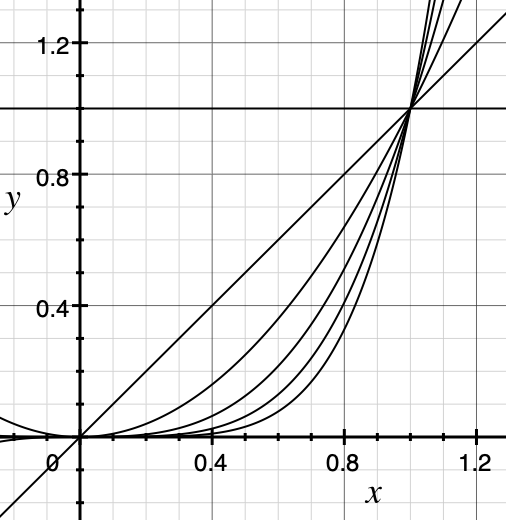

# 插值 {Interpolate}

其实之前写B样条就多处涉及到插值。但是这里还是简单总结一下有关插值，首先插值是给我们一些点，想让我们重建整个函数，这样给我们新的点，我们可能也可以做预测之类的，可以让我们从有限维到无限维。

插值最简单/方便的理解方式就是有一组基 $\phi_1, \phi_2, \cdots$：

$$
f(x) = \sum_i a_i \phi_i(x)
$$

其中 a 是我们要求的。

以下讨论针对 k 个点 $(x_1, y_1), \cdots, (x_k, y_k)$ 满足 $x_1 < x_2 < \cdots < x_k$

## 多项式插值

最简单的就是多项式插值:

$$
f(x) = a_0 + a_1x + a_2 x^2 + \cdots + a_{k-1} x^{k-1}
$$

我们可以写出方程：

$$
\begin{bmatrix}
1 & x_1  & \ldots & x_1^{k-1} \\
1 & x_2  & \ldots & x_2^{k-1} \\
\vdots & \vdots    & \vdots    &  \vdots   \\
1 & x_{k-1}  & \ldots & x_k^{k-1} \\
\end{bmatrix}
\begin{bmatrix} a_0 \\ a_1  \\ \vdots \\ a_{k-1} \end{bmatrix}  =
\begin{bmatrix} y_1 \\ y_2  \\ \vdots \\ y_k \end{bmatrix}
$$

这里的已知是 x,y 要求的是 a, 求解线性方程组，既可得到答案。

多项式插值的问题肉眼可见，那就是基 

$$
\{1, x, x^2, \cdots, x^{k-1}\}
$$

明显不是一组很好的基。而且正如 B样条 中写过，多项式次数高，会波动很大。

## 拉格朗日插值法

另一种多项式插值方法是把基选择为：

$$
\phi_i(x) = \frac{\prod_{j \ne i} (x - x_j)}{\prod_{j \ne i} (x_i - x_j)}
$$

基满足：

$$
\phi_i(x_l) = \begin{cases}
      1, l = i\\
      0, otherwise
\end{cases}
$$

针对 拉格朗日 插值法一种简单的理解就是 多项式 * 多项式 依旧是多项式，而它的基也就是这样定的。用一个具体的例子，比如三个点会更加容易理解拉格朗日插值法。

这种多项式插值的问题在于：计算大，同时如果有两个点很靠近的话 $x_i \approx x_j$, 计算就会有较大的问题。当然上面提到的多项式插值的问题它也依旧存在。

多项式插值还有的问题包括：比如我们增加一个点，或者改变一个点，会对所有的系数a都产生影响，所以有了牛顿插值法。

## 牛顿插值法

牛顿插值法的基我们写成：

$$
\phi_i(x) = \prod_{j = 1}^{i - 1} (x - x_j)
$$

其中 

$$
\phi_1(x) = 1
$$

容易看出：

$$
\phi_i(x_l) = 0, l < i
$$

牛顿插值法的关键之处就是 我们只考虑跟它前面有关的点， 我们展开 $f(x) = \sum_i a_i \phi_i(x)$ 可得线性方程组：

$$
\begin{bmatrix}
\phi_1(x_1) & 0  & \ldots & 0 \\
\phi_1(x_1) & \phi_2(x_2)  & \ldots & 0 \\
\vdots & \vdots    & \vdots    &  \vdots   \\
\phi_1(x_1) & \phi_2(x_2)  & \ldots & \phi_k(x_k) \\
\end{bmatrix}
\begin{bmatrix} a_1 \\ a_2  \\ \vdots \\ a_k \end{bmatrix}  =
\begin{bmatrix} y_1 \\ y_2  \\ \vdots \\ y_k \end{bmatrix}
$$

除了上面这些常见的插值基以外，我们还可以有，比如：

$$
f(x) = \frac{p_0 + p_1x + p_2 x^2 + \cdots + p_m x^m}{q_0 + q_1x + q_2 x^2 + \cdots + q_n x^n}
$$

## 分段插值

分段插值可以说是 spline 的灵魂所在，感觉分段插值的好处是 local 性比较好，添加/减少/改变一个点 不会对全局影响那么高，个人感觉有限元的基础也是线性分段插值。

插值之所以重要是前面提到了，它可以某种程度让我们有限到无限，给一些点，我们可以插值(interpolate )，可以外推（extrapolate），而计算机图形学中插值又无处不在，可以涉及到 linear， bilinear， trilinear， bicubic， 也就是一个插值，让我们能从三角形 mesh 能渲染出好看的场景，玩出无数的花样。

