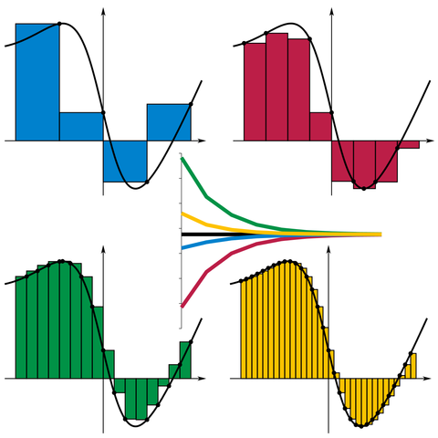
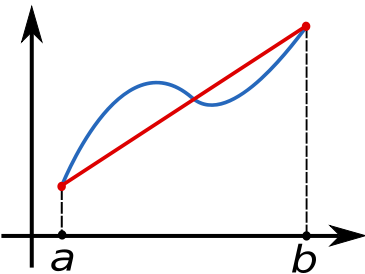
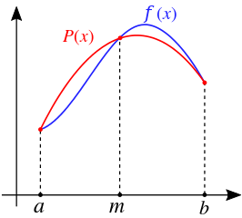

# 数值积分和微分{Numerial Intergration}

## 积分

针对 $f: \mathbb{R} \to \mathbb{R}$

### 黎曼和

记得我第一次看 黎曼和/黎曼积分 的时候觉得真是有意思，觉得这个东西很不言自明，我们推推导积分的时候从有限小到无限小，而当我们为了计算机计算，又从无穷小到可衡量的有限小。有意思。

积分也就是求和。而且觉得这一切都和 中值定理 有着千丝万缕的联系，o(╯□╰)o ：

> 对一个在闭区间 [a,b]有定义的实值函数f, f关于取样分割$ x_{0},\ldots ,x_{n}、t_{0},\ldots ,t_{n-1}$ 的黎曼和（积分和）定义为以下和

> 
$$
\sum _{i=0}^{n-1}f(t_{i})(x_{i+1}-x_{i})
$$

> 和式中的每一项是子区间长度 $ x_{i+1}-x_{i}$ 与在 $t_{i}$ 处的函数值 $f(t_{i})$ 的乘积。直观地说，就是以标记点 $t_{i}$ 到 X轴 的距离为高，以分割的子区间为长的矩形的面积。

在上图中， $f(t_i)$ 选择分别为 左端、右端、极小值、极大值。

###  梯形法则

在一个‘小区间’我们就能玩出很多花样：

比如我们如果取两端来估算 面积 的话：

$${\displaystyle \int \limits _{a}^{b}f(x)dx\approx {\frac {b-a}{2}}[f(a)+f(b)]}$$

我们也可以取区间中点的高度来估计 面积：

$${\displaystyle \int \limits _{a}^{b}f(x)dx\approx (b-a)f({\frac {a+b}{2}})}$$

以上都被称为 梯形法则（Trapezoidal rule），这里可以是整个函数，也可以只是一个小区间，我们可以用黎曼和来对待小区间：

1. 分割许多小区间
2. 把小区间加起来

### 辛普森法则

> 辛普森法则（Simpson's rule）是一种数值积分方法，是牛顿-寇次公式的特殊形式，以二次曲线逼近的方式取代矩形或梯形积分公式，以求得定积分的数值近似解。其近似值如下：

$$\int_{a}^{b} f(x) \, dx \approx \frac{b-a}{6}\left[f(a) + 4f\left(\frac{a+b}{2}\right)+f(b)\right]$$

辛普森法则可以令 $f(x) = A x^2 + Bx  + C$ 然后推导出来。

同样也可以分割小区间然后求和。

实际上上面两种无非是采取了不不同的近似，梯形法则 使用直线来近似原函数， 辛普森法则 使用二次曲线来 近似原函数。它们都是 牛顿-柯特斯公式（Newton-Cotes rule / Newton-Cotes formula） 的特殊形式。

### 牛顿-柯特斯公式 

还有一些有趣的看法，比如我们始终是利用 n 个离散的点的值来得到积分结果 - 一个数字，那么积分总可以写成这样：

$$\int _{a}^{b}f(x)\,dx\approx \sum _{{i=0}}^{n}w_{i}\,f(x_{i})$$

这种看法的原理是：

- 假设已知 $f(x_{0}),f(x_{1}),\dots ,f(x_{n})$ 的值。
- 以n+1点进行插值，求得对应 f(x)的拉格朗日多项式。
- 对该n次的多项式求积。

该积分便可以作为 $\int _{a}^{b}f(x)\,dx$ 的近似，而由于该拉格朗日多项式的系数都是常数（由n决定其值），所以积函数的系数（即 $w_{i}$）都是常数。

或者就这样写：

$$
\begin{aligned}
\int_a^b f(x)dx &= \int_a^b \bigg[ \sum_i a_i \phi_i(x)\bigg] dx  \\
&=\sum_i a_i \bigg[ \int_a^b  \phi_i(x)\bigg] dx\\
&= \sum_i c_i a_i, \text{ for } c_i \equiv \int_a^b \phi_i(x) dx
\end{aligned}
$$

然后我们就可以写出方程组：

$$
w_1 \cdot 1 + w_2 \cdot 2 + \cdots + w_n \cdot 1 = \int_a^b 1dx = b - a \\
w_1 \cdot x_1 + w_2 \cdot x_2 + \cdots + w_n \cdot x_n = \int_a^b xdx = (b^2 - a^2)/2 \\
\vdots \\
w_1 \cdot x_1^{n-1} + w_2 \cdot x_2^{n-1} + \cdots + w_n \cdot x_n^{n-1} = \int_a^b x^{n-1}dx = (b^n - a^n)/n \\
$$

然后也就是一个解线性方程组的问题。

这个方法明显会有 高阶多项式震荡的厉害的 龙格现象， 我还是更喜欢拆小区间，然后再组合小区间的做法。

### 精确度

用 拆小区间再复合 梯形法则的精确度是 $O(\Delta x^3)$, 辛普森 的精确度是 $O(\Delta x^4)$

针对 $f: \mathbb{R}^k \to \mathbb{R}$， 好像针对多元函数，蒙特卡洛积分比较常见/用一点。

## 微分

关于微分，我们首先也可以用插值类似的思想来看

$$
f'(x) = \sum_i a_i \phi_i'(x)
$$

这是有限元的思想。

当然更简单的就是我们直接从定义入手：

$$
f'(x) = \lim_{h \to 0} \frac{f(x+h) - f(x)}{h}
$$

选择比较小的h， 得到 前向差分公式：

$$
f'(x) \approx  \frac{f(x+h) - f(x)}{h}
$$

也可以从 x 向后 得到 后向差分公式：

$$
f'(x) \approx \frac{f(x) - f(x-h)}{h}
$$

以上两个式子本质都是用的泰勒展开：

$$
f(x+h) = f(x) + f'(x) h + \frac{1}{2} f''(x) h^2 + \cdots
$$

精度为 O(h):

$$
f'(x) = \frac{f(x+h) - f(x)}{h} + O(h)
$$

或者我们可以用下面的办法展开：

$$
f(x+h) = f(x) + f'(x) h + \frac{1}{2} f''(x) h^2 + \frac{1}{6}f'''(x)h^3 + \cdots  \tag{1}\\
$$

$$
f(x-h) = f(x) - f'(x) h + \frac{1}{2} f''(x) h^2 - \frac{1}{6}f'''(x)h^3 + \cdots  \tag{2}
$$
上下两式相减：

$$
f(x+h) - f(x -h) = 2f'(x) + \frac{1}{3}f'''(x)h^3 + \cdots 
$$

这叫做 中点差分公式， 精度是 $O(h^2)$

$$
f'(x)  \approx \frac{f(x+h) - f(x-h)}{2h}
$$

我们也可以用（1），（2）式得到二阶导数的 O(h) 中点差分公式：

$$
f''(x) \approx \frac{f(x+h) - 2f(x) +  f(x-h)}{h^2}
$$

我们可以利用 理查德森外推法 来提高 二阶导的精度：

$$
D(h) = \frac{f(x+h) - f(x)}{h} = f'(x) + \frac{1}{2} f''(x) h + O(h^2)
$$

对于任意 $\alpha$ ，我们可以有 $D(h), D(\alpha h)$:

$$
D(h) = f'(x) + \frac{1}{2} f''(x) h + O(h^2) \\
D(\alpha h) = f'(x) + \frac{1}{2} f''(x) \alpha h + O(h^2) \\
$$

写成矩阵形式：

$$
 \begin{pmatrix} D(h) \\ D(\alpha h) \end{pmatrix}   = \begin{pmatrix} 1 & \frac{1}{2}h  \\ 1 & \frac{1}{2}\alpha h  \end{pmatrix}\begin{pmatrix} f'(x) \\ f''(x) \end{pmatrix}   + O(h^2)
$$

$$
\begin{pmatrix} f'(x) \\ f''(x) \end{pmatrix} = \begin{pmatrix} 1 & \frac{1}{2}h  \\ 1 & \frac{1}{2}\alpha h   \end{pmatrix}^{-1}  \begin{pmatrix} D(h) \\ D(\alpha h) \end{pmatrix}  + O(h^2)
$$

这样可以以解出精度为 $O(h^2)$ 的 f'(x):

$$
f'(x) = \frac{1}{1- \alpha}(-\alpha D(h) + D(\alpha h)) + O(h^2)
$$

参考：

- [差分](https://zh.wikipedia.org/wiki/差分#單位步長情況)
- [理查德森外推法](https://zh.wikipedia.org/wiki/理查德森外推法)
- [牛顿-柯特斯公式](https://zh.wikipedia.org/wiki/牛頓－寇次公式)
- [Taylor series](https://en.wikipedia.org/wiki/Taylor_series)
- [Riemann_sum](https://en.wikipedia.org/wiki/Riemann_sum)
- [Trapezoidal rule](https://en.wikipedia.org/wiki/Trapezoidal_rule)
- [Simpson's rule](https://en.wikipedia.org/wiki/Simpson%27s_rule)

数值积分和微分当然非常有用，中文翻译的 差分 也很合适，其实数值积分和微分就是 求和 和 差分。这当然很重要，有了 积分和微分（求和和差分）才能帮我们把一些数学方程/模型方便的用到计算机上。

比如 渲染领域 的蒙特卡洛积分。

然后发现 Scipy 也提供 integrate， 可以查看： [SciPy求函数的积分](http://liao.cpython.org/scipy18/)

