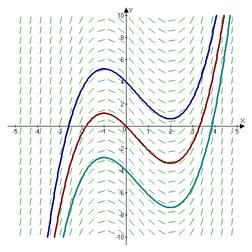
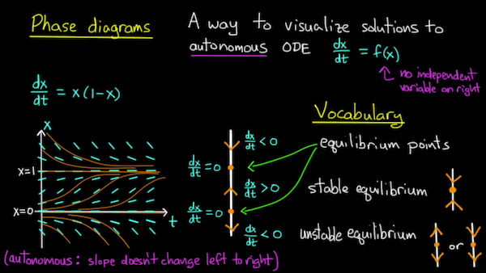

# 常微分方程 {ODE}

微分方程- 即使只是常微分方程（ ordinary differential equation， ODE) 也是非常有趣的。

比如牛顿第二定律：

$$
m\frac{d^2 x}{d t^2} = F(x)
$$

比如大名鼎鼎的 logistic function:

$$\frac{dP}{dt} = P$$

## 基本形式

$$
F(t): \mathbb{R} \to \mathbb{R}^n \\
\text{satifying }: F[t, f(t), f'(t), f''(t), \cdots, f^{(k)}(t)] = 0 \\
\text{Given } f(0), f'(0), f''(0), \cdots, f^{(k-1)}(0)
$$

给我们上面的式子，希望我们能推导出 $f(t), f'(t), \cdots, f^{(k)}(t)$ 随着时间 t 的变化。

-  显式 vs 隐式

上面这个事实叫做 n 阶隐式（implicit）常微分方程，有的时候我们可以把它化为显式 （explicit）的：

$$
f^{(k)}(t) = F[t, f(t), f'(t), f''(t), \cdots, f^{(k-1)}(t)] 
$$

比如上面的两个例子都是显式的。

-  自治 vs 非自治

自治（autonomous） 系统形式如下，一般来说，也就是 f 与时间无关：

$$
\frac{d}{dt}x(t)=f(x(t))
$$

比如上面我们的牛顿第二定律， 非自治形式如下：

$$
{\displaystyle {\frac {d}{dt}}x(t)=g(x(t),t)}
$$

物理上来说，这表示空间中一点的性质不仅取决于它的位置，还取决于时间：在不同的时间，经过此一点的质点或粒子会受到不同的影响。

- 其它

当然常微分方程还有许多其它的分类，比如线性、齐次等.

## 显式 ODE

假设我们有 ODE 如下：

$$
y''' = 3y'' - 2y' + y
$$

因为有： 

$$
\frac{d^2 y}{d t^2} = \frac{d}{dt} \bigg( {\frac{dy}{dt}} \bigg)\\
$$

我们令： 

$$
z = \frac{dy}{dt}\\
w = \frac{d^2 y}{d t^2}
$$

我们可以把上面的式子写成：

$$
\frac{d}{d t}\begin{pmatrix} y \\ z \\ w \end{pmatrix} =  \begin{pmatrix} 0 & 1 & 0 \\ 0 & 0 & 1 \\ 1 & -2 & 3 \end{pmatrix}\begin{pmatrix} y \\ z \\ w \end{pmatrix} 
$$

我们可以把显式的 ODE 转化成一阶ODE。更一般的，对于显式 ODE:

$$f^{(k)}(t) = F[t, f(t), f'(t), f''(t), \cdots, f^{(k-1)}(t)] 
$$

我们都可以把之转化成一阶 ODE:

$$
\frac{d}{d t}\begin{pmatrix} g_1(t) \\ g_2(t) \\ \vdots \\ g_{k-1}(t) \\ g_k(t) \end{pmatrix} = \begin{pmatrix} g_2(t) \\ g_3(t)\\  \vdots \\ g_k(t) \\ F[t, g_1(t), g_2(t),  \cdots, g_{(k-1)}(t)]  \end{pmatrix} 
$$

上面这个式子中： $g_2(t) = g_1'(t), g_3(t) = g_2'(t) = g_1''(t)$.

更好的是，我们可以把显式的微分方程转化为自治的，如果有： $f'(t) = F[t, f(t)]$, 我们令 $g(t) = t$, 则 $f'(t)$ 可以写成：

$$
\frac{d}{d t}\begin{pmatrix} g(t) \\ f(t) \end{pmatrix} = \begin{pmatrix} 1 \\ F[g(t), f(t)] \end{pmatrix} 
$$

所以我们只需要考虑一阶自治ODE，即：

$$
f'(t) = F[f(t)]
$$

## 可视化

如果我们想可视化ODE，一般会使用两种方法。

- 斜率场 slope field

> A slope field is a collection of short line segments, whose slopes match that of a solution of a first-order differential equation passing through the segment's midpoint.  The pattern produced by the slope field aids in visualizing the shape of the curve of the solution.  This is especially useful when the solution to a differential equation is difficult to obtain analytically.

上图画的是斜率场为：

$$
\frac{dy}{dx} = x^2 - x - 2
$$

其中 蓝、红、青 的线条分别是：

$$
x^3/3 - x^2/2 -2x+4 \\
x^3/3 - x^2/2 -2x \\
x^3/3 - x^2/2 -2x-4
$$

肉眼可以某种程度的看出它们满足这个斜率场。

当然这是极好的状况，有时候即使算不出来解析解，我们画出这个斜率场也能某种程度的了解我们的ODE变化情况。

- 相图 phase diagram

比如看上面这个 $dx/dt = f(x)$:

$$
\frac{dx}{dt} = x(1-x)
$$

因为它是自治的， 所以斜斜率场的斜率不会随着时间变化， 在 x = 0 与 x = 1 处 有 $dx/dt = 0$, 然后自然而然的就是画出右边的 phase line，可以容易看出它的平衡点与平衡状态。

## 解的状况

对于 $y' = 2y/t$:

$$
\frac{dy}{dt} = \frac{2y}{t}
$$

通过分离变量法可以解的： 

$$
ln |y| = 2 ln t + c
$$

或者写成： $y = Ct^2$

- 无解

如果我们给定初始值 $y(0) \ne 0$，那么明显方程无解。

- 解不唯一

如果我们给定初始值 $y(0) = 0$, 那么对于任意的 $C \in \mathbb{R}$ 都成立。

- 存在并且解唯一

如果F满足利普希茨连续（Lipschitz continuity），也就是 $|F[\vec{y}]-F[\vec{x}]|_2 \leq L|\vec{y}-\vec{x}|_2$ ，那么 $f'(t) = F[f(t)]$ 会有唯一解。

## 线性ODE

我们先来研究最简单的 ODE 之一，也就是：

$$
y' = ay
$$

上述方程可以解出：

$$
y(t) = Ce^{at}
$$

针对不同的a，我们可以画出如下图：

- a = 0: y(t)常数，跟t无关， 解稳定
- a < 0: t增加，y(t)趋于0， 解稳定
- a > 0: t增加，y(t)增加，  解不稳定

如果上面的线性ODE推广到多维：

$$
\vec{y}' = A \vec{y}
$$

如果 $\vec{y}_1, \cdots, \vec{y}_k$ 是 A 的特征向量， $\lambda_1, \cdots, \lambda_k$ 是与之对应的特征值，并且 $\vec{y}(0) = c_1\vec{y}_1 + \cdots + c_k\vec{y}_k$， 那么：

$$
\vec{y}(t) = c_1 e^{\lambda_1 t}\vec{y}_1 + \cdots + c_k e^{\lambda_k t}\vec{y}_k
$$

对于更加一般的ODE $\vec{y}' = F[\vec{y}]$, F 可微，那么可以写成：

$$
F[\vec{y}] = F[\vec{y}_0] + J_F(\vec{y}_0)(\vec{y} - \vec{y}_0)
$$

这也是告诉我们给我们 $t_k$ 时间的 $\vec{y}_k$, 我们可以利用 $\vec{y}' = F[\vec{y}]$ 近似出 $\vec{y}_{k+1}$。

## 求解

### 前向欧拉法

依旧利用的是泰勒展开：

$$y_{k+1} = y_k+hF[y_k]$$

假设 y' = ay 讨论它的稳定性的话会发现 $a < 0 ,0 \le h \le \frac{2}{|a|}$ 是稳定的， 所以就是选取的步长 h 不能过大。给定初始条件，然后就可以利用给定初始条件选定h开始数值求解。

### 后向欧拉

$$y_k = y_{k+1} - hF[y_{k+1}]$$

做出同样假设来讨论稳定性的话发现它总是稳定的。但是利用这个后向欧拉是隐式的， 我们需要先计算出 $y_{k+1}$.

其它还有一些跟数值积分类似的方法，也有一些新的方法，暂时先略去。

