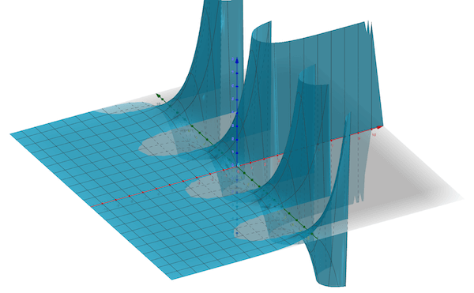

# 偏微分方程 {PDE}

常微分方程（ODE） 的时候我们更多是关于时间的导数。偏微分方程（partial differential equation) 则不仅仅是与时间相关，加上了与空间位置相关的一些信息。

## 解

当 ODE 满足 利普希茨连续（Lipschitz continuity），我们就可以有唯一解。但是 PDE 我们可能并没有这样好的性质，我们不知道它是否应该有解，很多时候也许我们就是用有限元方法（finite element method）来模拟，如果看到的结果还不错的话，我们就当这个就是它的解，o(╯□╰)o

## 运算符

首先需要搞清楚： 梯度、散度、旋度、拉普拉斯 运算符:

$$ f: \mathbb{R}^3 \to \mathbb{R}, \vec{v}: \mathbb{R}^3 \to \mathbb{R}^3  \\
\text{Gradient: } \nabla f = \big( \frac{\partial f}{\partial x_1}, \frac{\partial f}{\partial x_2},\frac{\partial f}{\partial x_3}\big) \\
\text{Divergence: } \nabla \cdot \vec{v} = \frac{\partial v_1}{\partial x_1} + \frac{\partial v_2}{\partial x_2} + \frac{\partial v_3}{\partial x_3} \\
\text{Curl: } \nabla \times \vec{v} = \big( \frac{\partial v_3}{\partial x_2} - \frac{\partial v_2}{\partial x_3} ,  \frac{\partial v_1}{\partial x_3} - \frac{\partial v_3}{\partial x_1}, \frac{\partial v_2}{\partial x_1} - \frac{\partial v_1}{\partial x_2} \big) \\
\text{Laplacian: } \nabla^2 f = \frac{\partial^2 f}{\partial x_1} + \frac{\partial^2 f}{\partial x_2} + \frac{\partial^2 f}{\partial x_3}
$$

| 运算符 operator | 运算量 operand	| 结果 result  |
|:------------- |:---------------:| -------------:|
| 梯度 Gradient | 多元函数 Multivariate function $f:\mathbb{R}^3 \to \mathbb{R}$ |  矢量 Vector $\mathbb{R} \to \mathbb{R}^3$ |
| 散度 Divergence	 | 矢量场 Vector Field $\vec{v}: \mathbb{R}^3 \to \mathbb{R}^3$      | 纯量 scalar $\mathbb{R}^3 \to \mathbb{R}$ |
| 旋度 Curl | 矢量场  Vector Field $\vec{v}: \mathbb{R}^3 \to \mathbb{R}^3$       |            矢量场 Vector Field $\mathbb{R}^3 \to \mathbb{R}^3$  |
| 拉普拉斯 Laplacian | 多元函数 Multivariate function $f:\mathbb{R}^3 \to \mathbb{R}$ |  纯量 scalar $\mathbb{R}^3 \to \mathbb{R}$|

关于 梯度、散度、旋度 以及 拉普拉斯可以理很久，如果需要复习，可以参见之前我写过的两篇：

- [梯度旋度散度](https://zhuanlan.zhihu.com/p/71504738)
- [梯度、散度、旋度](https://zhuanlan.zhihu.com/p/97545154)

在 物理 有关的偏微分方程中，如果函数是 $f(t; x, y, z)$， 当我们写到 nabla 运算符是 $\nabla = \big( \frac{\partial }{\partial x}, \frac{\partial }{\partial y},\frac{\partial }{\partial z}\big)$ ,是与 t 无关的。

## 纳维-斯托克斯方程 Navier-Stokes equations

Navier-Stokes equations 是大概做流体模拟的一个基础方程，是一个典型的 PDE 方程：
$$
\rho\bigg( \frac{\partial \vec{v}}{\partial t} + \vec{v} \cdot \nabla \vec{v} \bigg) = -\nabla p + \mu \nabla^2 \vec{v} + \vec{f} \\
t \in [0, \infty): \text{time  时间}  \\
\vec{v}(t): \Omega \to \mathbb{R}^3 : \text{velocity 速度} \\
\rho(t): \Omega \to \mathbb{R}: \text{density 密度} \\
p(t): \Omega \to \mathbb{R}: \text{pressure 压力} \\
\vec{f}(t): \Omega \to \mathbb{R}^3: \text{external force 外力，比如重力等} \\
$$

或者我们用 wikipedia 中的写法：
$$
{\displaystyle \overbrace {\rho {\Big (}\underbrace {\frac {\partial \mathbf {v} }{\partial t}} _{\begin{smallmatrix}{\text{Unsteady}}\\{\text{acceleration}}\end{smallmatrix}}+\underbrace {(\mathbf {v} \cdot \nabla )\mathbf {v} } _{\begin{smallmatrix}{\text{Convective}}\\{\text{acceleration}}\end{smallmatrix}}{\Big )}} ^{\text{Inertia}}=\underbrace {-\nabla p} _{\begin{smallmatrix}{\text{Pressure}}\\{\text{gradient}}\end{smallmatrix}}+\underbrace {\mu \nabla ^{2}\mathbf {v} } _{\text{Viscosity}}+\underbrace {\mathbf {f} } _{\begin{smallmatrix}{\text{Other}}\\{\text{forces}}\end{smallmatrix}}}
$$
光看这个形式就很复杂了，是否可解这里光看式子就会想打上很多问号？？？所以克雷数学研究所的千禧年七大问题之一就是有关于 Navier-Stokes equations，

> Prove or give a counter-example of the following statement:

> In three space dimensions and time, given an initial velocity field, there exists a vector velocity and a scalar pressure field, which are both smooth and globally defined, that solve the Navier–Stokes equations.

价值 $1,000,000

其它的百万问题还包括：

- P vs NP
- 霍奇猜想
- 庞加莱猜想
- 黎曼猜想
- ...

## 麦克斯韦方程组 Maxwell's equations

最最出名的 PDE 应该是 - 麦克斯韦方程组：
$$
\text{Gauss's law: } \nabla \cdot \mathbf {E} ={\frac {\rho }{\varepsilon _{0}}}\\
\text{Gauss's law for magnetism: }\nabla \cdot \mathbf {B} =0\\
\text{Maxwell–Faraday equation: }\nabla \times \mathbf {E} =-{\frac {\partial \mathbf {B} }{\partial t}}\\
\text{Ampère's circuital law: }\nabla \times \mathbf {B} =\mu _{0}\left(\mathbf {J} +\varepsilon _{0}{\frac {\partial \mathbf {E} }{\partial t}}\right)
$$

## 拉普拉斯方程 Laplace's equation

拉普拉斯方程非常出名， 形式简单：

$$
\nabla^2 f(\vec{x}) = 0
$$
它是泊松方程的特殊形式。

拉普拉斯方程又被称为调和方程。因为调和函数（harmonic function）的定义也就是函数满足拉普拉斯方程。

之所以被定义为调和（harmonic）大概起因和 泛音(overtone)相关。

关于 调和函数 的另一种感性的理解就是如果我们把 拉普拉斯运算符 看成 类似二阶导一样的东西。

- 对于  $f: \mathbb{R} \to \mathbb{R}$ :  二阶导 决定了这个函数的 凹凸性, 或者说 二阶导 决定了这个点周围的函数值是比它大还还是比它小。二阶导 在这里变成了我们比较函数的与它邻居的大小。

- 对于 $f: \mathbb{R}^n \to \mathbb{R}$ : 如果把它看成类似二阶导，那么我们假设取一个点，然后看它周围的圆（球，反正是与这个点距离相等的函数上的点），它们的平均值是跟这个点是一样的。

比如上面的 harmonic function: $f(x,y) = e^x siny$， 虽然难以想象，但是比如我们在之上任意取一个点，这个点周围的圆上面的函数值的平均是一样的，在平坦的部分还容易想到这个结论，在有起伏的地方比较难想象到。

平均值一样,某种意义上就代表稳定。

以下的两个说法来自知乎问题： [调和函数到底有什么意义？](https://www.zhihu.com/question/25083195)

> 物理上可以用来描述一个稳定的状态，比如定常的温度场，自由电场电势，引力势能等等。数学上，比如说调和函数直接对应到复变里面的全纯函数，微分几何里面调和函数对应的是极小曲面，黎曼几何里调和函数可以推广到调和形式，然后就可以有Hodge 分解……上面每一个都可以展开，而且我强烈感觉我没想全……简直太有意义了

> 调和函数的线性组合仍为调和函数，所以是一个函数空间。调和函数无限次可导。调和函数在定义域的紧子集的边界上达到最大最小值，这是一种类似单调的性质。加上其他的一些性质，导致调和函数容易处理也更可能满足某些规律。以上是数学工作者看重的某些意义，你或许会觉得这不叫意义，那么可以考虑在物理学上的意义：二阶偏导的和等于零，对应于加速度的和为零，即可以描述系统不受力的状态，即稳态。当不能刻画系统在每一时刻的状态，却能用调和函数描述系统稳态下的状态，调和函数就显得非常有意义了。

回头继续, 先扔一个问题的 setup：
$$
\text{minimize}_f \int_\Omega \parallel \nabla f(\vec{x}) \parallel_2^2 d\vec{x} \\
\text{such that } f(\vec{x}) = g(\vec{x}) , \forall \vec{x} \in \partial \Omega
$$
也就是我们给定区域 $\Omega$， 它有边界 $\partial \Omega$，边界上 $\partial  \Omega$ 有函数 $g(\vec{x})$ ，我们想要找到一个函数满足 $f(\vec{x}) = g(\vec{x})$，也就是在这个边界上相等。

那么 $\text{minimize}_f \int_\Omega \parallel \nabla f(\vec{x}) \parallel_2^2 d\vec{x}$ 是在干什么呢？实际上这个函数有自己的名字 - 狄利克雷能量(Dirichlet's energy)： 
$$
E[f] = \int_\Omega \parallel \nabla f(\vec{x}) \parallel_2^2 d\vec{x}
$$
这个 energy function 代表的是什么？

梯度代表的是 函数 的变化，类似于导数，这个一整个 梯度的 l2 norm的平方积分 - 导数变化求和，最小化 它 也就是最小化函数的变化。所以上面这个问题也就是在尝试：

- 在边界满足 f = g
- 最小化函数 f 在区域内的变化

也就是让函数尽量光滑，所以也就是 f 'as smooth as possible'.（ 记得之前还有过 'as rigid as possible')

可用变分解出，f 需要满足 拉普拉斯方程。

考虑任意h，需要有：
$$
E[f + h] \ge E[f]
$$
考虑 $E[f +  \epsilon h]$ :
$$
\begin{aligned}
E[f +  \epsilon h] &= \int_\Omega \parallel \nabla f(\vec{x}) + \epsilon \nabla h(\vec{x}) \parallel_2^2 d \vec{x} \\
&= \int_\Omega \big( \parallel \nabla f(\vec{x}) \parallel_2^2 + 2 \epsilon f(\vec{x}) \cdot \nabla h(\vec{x}) + \epsilon^2 \parallel \nabla h(\vec{x})\parallel_2^2 \big)  d \vec{x}
\end{aligned}
$$
关于 $\epsilon$ 求导：

$$
\begin{aligned}
\frac{ d }{d \epsilon}E[f +  \epsilon h] &= \int_\Omega \big( 2  f(\vec{x}) \cdot \nabla h(\vec{x}) +2 \epsilon \parallel \nabla h(\vec{x})\parallel_2^2 \big)  d \vec{x} \\
\frac{ d }{d \epsilon}E[f +  \epsilon h] |_{\epsilon = 0} &= 2 \int_\Omega \big(   f(\vec{x}) \cdot \nabla h(\vec{x})  \big)  d \vec{x} 
\end{aligned}
$$
上述推导对于任何 h 都成立，特殊的，我们取 $h(\vec{x}) = 0, \vec{x} \in \partial \Omega$， 然后利用分布积分，其实也就是 格林恒等式： 

$${\displaystyle \int _{\Omega }\nabla u\cdot \nabla v\,d\Omega \ =\ \int _{\Gamma }v\,\nabla u\cdot {\hat {\mathbf {n} }}\,d\Gamma -\int _{\Omega }v\,\nabla ^{2}\!u\,d\Omega }$$

上面式子可以转化为：

$$
\frac{ d }{d \epsilon}E[f +  \epsilon h] |_{\epsilon = 0} = -2 \int_\Omega \big(   h(\vec{x}) \nabla^2 f(\vec{x})  \big)  d \vec{x} 
$$
这个式子恒等于0，所以也就是：
$$
\nabla^2 f(\vec{x}) = 0, x \in \Omega \setminus  \partial \Omega
$$
也就是我们需要求解的 PDE 为：
$$
\begin{aligned}
\nabla^2 f(\vec{x}) &= 0 \\
f(\vec{x}) &= g(\vec{x}), \forall \vec{x} \in \partial \Omega
\end{aligned}
$$
其实也就是 狄利克雷问题（Dirichlet problem）：

> 给定定义在 $\mathbb{R}^n$ 中一个区域的边界上一个函数 g，是否存在惟一连续函数 f 在内部两次连续可微，在边界上连续，使得 f 在内部调和并在边界上 f = g ？

其实这个也蛮像插值问题的，比如之前的插值， 给一些点，推断出函数的模样。这也是给一个边界，想要知道函数在区域内的全貌。

## 调和分析 Harmonic analysis

$$\nabla^2f = \lambda f$$

这也是一类PDE问题，解特征方程。

## 边界条件 Boundary Value Problems

狄利克雷问题（Dirichlet problem）是给定边界，推断函数。类似的还包括：

- 狄利克雷边界条件 Dirichlet conditions:  $f(\vec{x}) = g(\vec{x}) \text{on } \partial \Omega$
- 诺伊曼边界条件 Neumann conditions: $\nabla f(\vec{x}) = g(\vec{x})  \text{on} \partial \Omega$
- 混合 Robin boundary condition:  类似 $af(\vec{x}) + b\nabla f(\vec{x})=g(\vec{x}) {\text{on }}\partial \Omega$

## 二阶PDE

二阶PDE 的一般形式是：
$$
\sum_{ij} a_{ij} \frac{\partial f} {\partial x_i \partial x_j} + \sum_i b_i \frac{\partial f}{\partial x_i} + cf = 0
$$
我们也可以把上述方程写成：
$$
(\nabla^T A \nabla + \nabla \cdot \vec{b} + c) f = 0
$$
我们可以根据上面的式子来分类：

- A 是 正定矩阵 或者 负定矩阵 （特征值全为正或者全为负） ： 椭圆型 elliptic
- A 是 半正定矩阵 或者 半负定矩阵 （特征值除了全正或者全负，可以加上0）： 抛物型 parabolic
- A只存在一个特征值和其他特征值符号不同 ： 双曲型 hyperbolic
- 不满足上述条件 ： 超双曲型 ultrahyperbolic

## 椭圆型 PDE

- 有解 & 唯一解
- $C^{\infty}$
- 拉普拉斯/泊松方程 $\nabla^2 f = g$

## 抛物型 PDE

- 短时间内的解是存在/唯一的
- 热方程： $\frac{\partial f}{\partial t} = \alpha \nabla^2 f$
- 边界条件 需要跟时间、空间相关

## 双曲型 PDE

- 波动方程: $\frac{\partial^2 f}{\partial t^2}  =  c^2 \nabla^2 f$ 
- 边界条件: 一阶导

## 微分看成算子

微分很容易验证其为成线性算子。

先看一维简单的例子，之前在数值积分和微分中已经讨论过，比如我们可以用离散、差分等方式把 $y_k''$ 看成:
$$
y_k'' = \frac{y_{k+1} - 2 y_k + y_{k-1}}{h^2}
$$
所以如果假设 f(x) 在 [0,1] 上有：
$$
y_0 = f(0), y_0 = f(h), y_2 = f(2h), \cdots ,y_n = f(nh) 
$$
那么，这里就从微分到了差分，其实应该也 '≈' :
$$
y_k'' = \frac{y_{k+1} - 2 y_k + y_{k-1}}{h^2}
$$

或者写成：

$$
y_k'' h^2 =  y_{k+1} - 2 y_k + y_{k-1}
$$

如果我们把 $y_k$ 写成向量 $\vec{y} \in \mathbb{R}^{n+1}$， 把 $y_k''$ 写成向量 $\vec{w} \in \mathbb{R}^{n+1}$，上面的式子可以写成:
$$
h^2 \vec{w} = L_1\vec{y}
$$

那么根据边界条件的不同，$L_1$ 可以为：

- Dirichlet
$$
{\begin{pmatrix}-2 & 1 & & & &  \\1 & -2 & 1 & & & \\ & 1 &-2&1& \\& &\ddots&\ddots&\ddots& \\ &  & & 1& -2& 1  \\ &  & & &1&-2 \end{pmatrix}}
$$

- Neumann
$$
{\begin{pmatrix}-1 & 1 & & & &  \\1 & -2 & 1 & & & \\ & 1 &-2&1& \\& &\ddots&\ddots&\ddots& \\ &  & & 1& -2& 1  \\ &  & & &1&-1 \end{pmatrix}}
$$
- 周期性   f(0) = f (1)
$$
{\begin{pmatrix}-2 & 1 & & & &1  \\1 & -2 & 1 & & & \\ & 1 &-2&1& \\& &\ddots&\ddots&\ddots& \\ &  & & 1& -2& 1  \\1 &  & & &1&-2 \end{pmatrix}}
$$
然后我们就像解线性系统一样来解这个系统了。

即使是 2D 的网格，我们也可以用类似的方法来离散：
$$
(\nabla^2 y)_{k,l} = \frac{1}{h^2} \big( y_{(k-1),l} + y_{k, (l-1)} + y_{(k+1), l} + y_{k,(l+1)} - 4 y_{k,l} \big)
$$
